## Entity-Relationship Diagram (Mermaid)

```mermaid
erDiagram
  User ||--o{ Booking : makes
  User ||--o{ Booking : guides
  User ||--o{ Review : writes
  User ||--o{ Review : guides
  User ||--o{ CustomTrip : requests
  User ||--o{ Hotel : owns
  User ||--o{ RoomAvailability : createdBy
  User ||--o{ RoomAvailability : lastModifiedBy
  User ||--o{ Driver : is
  User ||--o{ Vehicle : owns
  User ||--o{ VehicleAvailability : owns
  User ||--o{ VehicleBooking : books
  User ||--o{ VehicleBooking : messages.updatedBy
  User ||--o{ VehicleBooking : driver.assigned
  User ||--o{ VehicleBookingRequest : customer
  User ||--o{ VehicleBookingRequest : vehicleOwner
  User ||--o{ VehicleBookingRequest : statusHistory.updatedBy
  User ||--o{ VehicleBookingRequest : response.communication.sender
  User ||--o{ Trip : customer
  User ||--o{ Trip : vehicleOwner
  User ||--o{ Trip : driver
  User ||--o{ MaintenanceRecord : vehicleOwner
  User ||--o{ MaintenanceRecord : statusHistory.updatedBy
  User ||--o{ Revenue : vehicleOwner
  User ||--o{ ExternalBookingIntegration : owner

  Tour ||--o{ Booking : has
  Tour ||--o{ Review : reviewed
  Tour }o--o{ User : guide

  Booking }o--|| User : user
  Booking }o--|| Tour : tour
  Booking }o--|| User : guide

  Review }o--|| User : user
  Review }o--|| Tour : tour
  Review }o--|| Booking : booking
  Review }o--|| User : guide

  CustomTrip }o--|| User : customer
  CustomTrip }o--o{ User : staffResponse.respondedBy

  Hotel }o--|| User : owner
  Hotel ||--o{ Room : has
  Hotel ||--o{ RoomAvailability : has
  Hotel ||--o{ HotelBooking : has

  Room }o--|| Hotel : hotel
  Room ||--o{ RoomAvailability : has
  Room ||--o{ HotelBooking : booked

  RoomAvailability }o--|| Room : room
  RoomAvailability }o--|| Hotel : hotel
  RoomAvailability }o--|| User : createdBy
  RoomAvailability }o--|| User : lastModifiedBy

  HotelBooking }o--|| Hotel : hotel
  HotelBooking }o--|| Room : room
  HotelBooking }o--|| User : user

  Driver }o--|| User : user

  Vehicle }o--|| User : owner
  Vehicle ||--o{ VehicleAvailability : has
  Vehicle ||--o{ VehicleBooking : has
  Vehicle ||--o{ VehiclePricing : has
  Vehicle ||--o{ MaintenanceRecord : has
  Vehicle ||--o{ ExternalBookingIntegration : has
  Vehicle ||--o{ Trip : usedIn

  VehicleAvailability }o--|| Vehicle : vehicle
  VehicleAvailability }o--|| User : owner

  VehicleBooking }o--|| Vehicle : vehicle
  VehicleBooking }o--|| User : user
  VehicleBooking }o--o{ User : messages.sender
  VehicleBooking }o--|| User : driver.assignedDriver

  VehicleBookingRequest }o--|| User : customer
  VehicleBookingRequest }o--|| Vehicle : vehicle
  VehicleBookingRequest }o--|| User : vehicleOwner
  VehicleBookingRequest }o--o{ User : statusHistory.updatedBy
  VehicleBookingRequest }o--o{ User : response.communication.sender

  Trip }o--|| VehicleBookingRequest : bookingRequest
  Trip }o--|| Vehicle : vehicle
  Trip }o--|| User : driver
  Trip }o--|| User : customer
  Trip }o--|| User : vehicleOwner

  MaintenanceRecord }o--|| Vehicle : vehicle
  MaintenanceRecord }o--|| User : vehicleOwner

  Revenue }o--|| User : vehicleOwner

  ExternalBookingIntegration }o--|| Vehicle : vehicle
  ExternalBookingIntegration }o--|| User : owner

  VehiclePricing }o--|| Vehicle : vehicle
  VehiclePricing }o--|| User : owner
```



Notes
- This ERD is derived from Mongoose schemas under `backend/src/models`.
- Cardinalities: `||` one, `o{` many, `}o` zero-or-one, based on `required` flags and array usage.

## Detailed ER with attributes (Mermaid)

```mermaid
erDiagram
  User {
    ObjectId _id PK
    string firstName
    string lastName
    string email UK
    string password
    string role
    boolean isVerified
    boolean isActive
    number rating
  }

  Tour {
    ObjectId _id PK
    string title
    string category
    number duration
    number price
    ObjectId guide FK  // -> User
    boolean isActive
    boolean isFeatured
  }

  Booking {
    ObjectId _id PK
    ObjectId user FK     // -> User
    ObjectId tour FK     // -> Tour
    ObjectId guide FK    // -> User
    date bookingDate
    date startDate
    date endDate
    number totalAmount
    string status
    string paymentStatus
  }

  Review {
    ObjectId _id PK
    ObjectId user FK     // -> User
    ObjectId tour FK     // -> Tour
    ObjectId booking FK  // -> Booking
    ObjectId guide FK    // -> User
    number rating
    string comment
  }

  CustomTrip {
    ObjectId _id PK
    ObjectId customer FK // -> User
    string destination
    date startDate
    date endDate
    number groupSize
    number budget
    string status
  }

  Hotel {
    ObjectId _id PK
    string name
    string city
    string district
    ObjectId owner FK  // -> User
    string category
    number starRating
    string status
  }

  Room {
    ObjectId _id PK
    ObjectId hotel FK  // -> Hotel
    string roomType
    number basePrice
    string status
  }

  RoomAvailability {
    ObjectId _id PK
    ObjectId room FK   // -> Room
    ObjectId hotel FK  // -> Hotel
    date date
    string status
    number availableRooms
    ObjectId createdBy FK      // -> User
    ObjectId lastModifiedBy FK // -> User
  }

  HotelBooking {
    ObjectId _id PK
    string bookingReference UK
    ObjectId hotel FK // -> Hotel
    ObjectId room FK  // -> Room
    ObjectId user FK  // -> User
    date checkInDate
    date checkOutDate
    string bookingStatus
    string paymentStatus
  }

  Driver {
    ObjectId _id PK
    ObjectId user FK  // -> User
    string driverId UK
    string status
  }

  Vehicle {
    ObjectId _id PK
    ObjectId owner FK // -> User
    string licensePlate UK
    string vehicleType
    number pricing_basePrice
    string status
  }

  VehicleAvailability {
    ObjectId _id PK
    ObjectId vehicle FK // -> Vehicle
    ObjectId owner FK   // -> User
    date date
    boolean isAvailable
  }

  VehicleBooking {
    ObjectId _id PK
    string bookingReference UK
    ObjectId vehicle FK // -> Vehicle
    ObjectId user FK    // -> User
    ObjectId assignedDriver FK // -> User
    string bookingStatus
    string paymentStatus
  }

  VehicleBookingRequest {
    ObjectId _id PK
    string bookingReference UK
    ObjectId customer FK     // -> User
    ObjectId vehicle FK      // -> Vehicle
    ObjectId vehicleOwner FK // -> User
    string status
  }

  Trip {
    ObjectId _id PK
    string tripReference UK
    ObjectId bookingRequest FK // -> VehicleBookingRequest
    ObjectId vehicle FK        // -> Vehicle
    ObjectId driver FK         // -> User
    ObjectId customer FK       // -> User
    ObjectId vehicleOwner FK   // -> User
    string status
  }

  MaintenanceRecord {
    ObjectId _id PK
    ObjectId vehicle FK      // -> Vehicle
    ObjectId vehicleOwner FK // -> User
    string maintenanceType
    string status
  }

  Revenue {
    ObjectId _id PK
    ObjectId vehicleOwner FK // -> User
    number period_year
    number period_month
    string status
  }

  ExternalBookingIntegration {
    ObjectId _id PK
    ObjectId vehicle FK // -> Vehicle
    ObjectId owner FK   // -> User
    string platform
    string status
  }

  VehiclePricing {
    ObjectId _id PK
    ObjectId vehicle FK // -> Vehicle
    ObjectId owner FK   // -> User
    string pricingType
    string name
    boolean isActive
  }

  %% Relationships (crow's foot)
  User ||--o{ Booking : makes
  User ||--o{ Booking : guides
  User ||--o{ Review : writes
  User ||--o{ Review : guides
  User ||--o{ CustomTrip : requests
  User ||--o{ Hotel : owns
  User ||--o{ RoomAvailability : createdBy
  User ||--o{ RoomAvailability : lastModifiedBy
  User ||--o{ Driver : is
  User ||--o{ Vehicle : owns
  User ||--o{ VehicleAvailability : owns
  User ||--o{ VehicleBooking : books
  User ||--o{ VehicleBooking : driver.assigned
  User ||--o{ VehicleBookingRequest : customer
  User ||--o{ VehicleBookingRequest : vehicleOwner
  User ||--o{ Trip : customer
  User ||--o{ Trip : vehicleOwner
  User ||--o{ Trip : driver
  User ||--o{ MaintenanceRecord : vehicleOwner
  User ||--o{ Revenue : vehicleOwner
  User ||--o{ ExternalBookingIntegration : owner

  Tour ||--o{ Booking : has
  Tour ||--o{ Review : reviewed
  Tour }o--o{ User : guide

  Booking }o--|| User : user
  Booking }o--|| Tour : tour
  Booking }o--|| User : guide

  Review }o--|| User : user
  Review }o--|| Tour : tour
  Review }o--|| Booking : booking
  Review }o--|| User : guide

  CustomTrip }o--|| User : customer

  Hotel }o--|| User : owner
  Hotel ||--o{ Room : has
  Hotel ||--o{ RoomAvailability : has
  Hotel ||--o{ HotelBooking : has

  Room }o--|| Hotel : hotel
  Room ||--o{ RoomAvailability : has
  Room ||--o{ HotelBooking : booked

  RoomAvailability }o--|| Room : room
  RoomAvailability }o--|| Hotel : hotel

  HotelBooking }o--|| Hotel : hotel
  HotelBooking }o--|| Room : room
  HotelBooking }o--|| User : user

  Driver }o--|| User : user

  Vehicle }o--|| User : owner
  Vehicle ||--o{ VehicleAvailability : has
  Vehicle ||--o{ VehicleBooking : has
  Vehicle ||--o{ VehiclePricing : has
  Vehicle ||--o{ MaintenanceRecord : has
  Vehicle ||--o{ ExternalBookingIntegration : has
  Vehicle ||--o{ Trip : usedIn

  VehicleAvailability }o--|| Vehicle : vehicle
  VehicleAvailability }o--|| User : owner

  VehicleBooking }o--|| Vehicle : vehicle
  VehicleBooking }o--|| User : user
  VehicleBooking }o--|| User : assignedDriver

  VehicleBookingRequest }o--|| User : customer
  VehicleBookingRequest }o--|| Vehicle : vehicle
  VehicleBookingRequest }o--|| User : vehicleOwner

  Trip }o--|| VehicleBookingRequest : bookingRequest
  Trip }o--|| Vehicle : vehicle
  Trip }o--|| User : driver
  Trip }o--|| User : customer
  Trip }o--|| User : vehicleOwner

  MaintenanceRecord }o--|| Vehicle : vehicle
  MaintenanceRecord }o--|| User : vehicleOwner

  Revenue }o--|| User : vehicleOwner

  ExternalBookingIntegration }o--|| Vehicle : vehicle
  ExternalBookingIntegration }o--|| User : owner

  VehiclePricing }o--|| Vehicle : vehicle
  VehiclePricing }o--|| User : owner
```

How to export
- In many Markdown renderers that support Mermaid, you can right-click the diagram to export PNG/SVG.
- Alternatively, paste the Mermaid block into the Mermaid Live Editor and export: `https://mermaid.live`.

## Normalized Database Schema (Classic ER Style)

```mermaid
erDiagram
    User {
        _id PK
        firstName
        lastName
        email
        password
        phone
        role
        isVerified
        isActive
        rating
        avatar
        createdAt
        updatedAt
    }
    
    Tour {
        _id PK
        title
        description
        shortDescription
        duration
        price
        originalPrice
        maxParticipants
        minParticipants
        category
        difficulty
        guide_id FK
        isActive
        isFeatured
        rating_average
        rating_count
        createdAt
        updatedAt
    }
    
    Booking {
        _id PK
        user_id FK
        tour_id FK
        guide_id FK
        bookingDate
        startDate
        endDate
        duration
        groupSize
        totalAmount
        status
        paymentStatus
        paymentMethod
        specialRequests
        createdAt
        updatedAt
    }
    
    Review {
        _id PK
        user_id FK
        tour_id FK
        guide_id FK
        booking_id FK
        rating
        comment
        isVerified
        isActive
        helpful
        notHelpful
        createdAt
        updatedAt
    }
    
    CustomTrip {
        _id PK
        customer_id FK
        customerName
        customerEmail
        customerPhone
        destination
        startDate
        endDate
        duration
        groupSize
        budget
        status
        priority
        createdAt
        updatedAt
    }
    
    Hotel {
        _id PK
        name
        description
        shortDescription
        address
        city
        district
        latitude
        longitude
        owner_id FK
        category
        starRating
        status
        approvalDate
        rejectionReason
        createdAt
        updatedAt
    }
    
    Room {
        _id PK
        hotel_id FK
        name
        description
        roomType
        maxAdults
        maxChildren
        maxInfants
        size
        basePrice
        currency
        totalRooms
        availableRooms
        status
        isAvailable
        createdAt
        updatedAt
    }
    
    RoomAvailability {
        _id PK
        room_id FK
        hotel_id FK
        date
        status
        availableRooms
        totalRooms
        createdBy_id FK
        lastModifiedBy_id FK
        createdAt
        updatedAt
    }
    
    HotelBooking {
        _id PK
        bookingReference
        hotel_id FK
        room_id FK
        user_id FK
        checkInDate
        checkOutDate
        numberOfRooms
        adults
        children
        infants
        guestFirstName
        guestLastName
        guestEmail
        guestPhone
        guestNationality
        guestPassport
        basePrice
        taxes
        serviceCharge
        totalPrice
        currency
        bookingStatus
        paymentStatus
        specialRequests
        bookedAt
        confirmedAt
        cancelledAt
    }
    
    Driver {
        _id PK
        user_id FK
        driverId
        status
        dateOfBirth
        gender
        nationality
        emergencyContactName
        emergencyContactRelationship
        emergencyContactPhone
        emergencyContactEmail
        licenseNumber
        licenseType
        licenseIssueDate
        licenseExpiryDate
        issuingAuthority
        licenseClass
        baseRate
        currency
        commissionRate
        totalEarnings
        pendingPayout
        identityVerified
        licenseVerified
        backgroundCheckPassed
        createdAt
        updatedAt
    }
    
    Vehicle {
        _id PK
        owner_id FK
        name
        description
        vehicleType
        make
        model
        year
        color
        licensePlate
        passengerCapacity
        luggageCapacity
        wheelchairAccessible
        basePrice
        currency
        perKmRate
        hourlyRate
        dailyRate
        status
        approvedBy_id FK
        approvedAt
        rejectionReason
        createdAt
        updatedAt
    }
    
    VehicleAvailability {
        _id PK
        vehicle_id FK
        owner_id FK
        date
        isAvailable
        reason
        customReason
        createdAt
        updatedAt
    }
    
    VehicleBooking {
        _id PK
        bookingReference
        vehicle_id FK
        user_id FK
        pickupAddress
        pickupCity
        pickupDistrict
        pickupLatitude
        pickupLongitude
        dropoffAddress
        dropoffCity
        dropoffDistrict
        dropoffLatitude
        dropoffLongitude
        startDate
        endDate
        startTime
        endTime
        duration
        distance
        adults
        children
        infants
        guestFirstName
        guestLastName
        guestEmail
        guestPhone
        guestNationality
        guestPassport
        specialRequests
        basePrice
        distancePrice
        durationPrice
        taxes
        serviceCharge
        totalPrice
        currency
        bookingStatus
        paymentStatus
        paymentMethod
        transactionId
        paidAt
        assignedDriver_id FK
        assignedAt
        driverNotes
        bookedAt
        updatedAt
    }
    
    VehicleBookingRequest {
        _id PK
        bookingReference
        customer_id FK
        vehicle_id FK
        vehicleOwner_id FK
        pickupAddress
        pickupCity
        pickupDistrict
        pickupLatitude
        pickupLongitude
        dropoffAddress
        dropoffCity
        dropoffDistrict
        dropoffLatitude
        dropoffLongitude
        estimatedDistance
        estimatedDuration
        pickupDateTime
        dropoffDateTime
        adults
        children
        infants
        totalPassengers
        basePrice
        distancePrice
        timePrice
        subtotal
        tax
        totalPrice
        currency
        status
        ownerResponseStatus
        customerResponseStatus
        assignedDriver_id FK
        createdAt
        updatedAt
        expiresAt
    }
    
    Trip {
        _id PK
        tripReference
        bookingRequest_id FK
        vehicle_id FK
        driver_id FK
        customer_id FK
        vehicleOwner_id FK
        tripType
        tripCategory
        scheduledStartTime
        scheduledEndTime
        actualStartTime
        actualEndTime
        totalDistance
        estimatedDuration
        actualDuration
        basePrice
        distancePrice
        timePrice
        totalPrice
        currency
        status
        trackingActive
        lastKnownLatitude
        lastKnownLongitude
        lastKnownAddress
        lastKnownTimestamp
        createdAt
        updatedAt
    }
    
    MaintenanceRecord {
        _id PK
        vehicle_id FK
        vehicleOwner_id FK
        maintenanceType
        maintenanceReference
        serviceProviderName
        serviceProviderType
        scheduledDate
        actualStartDate
        actualEndDate
        estimatedDuration
        actualDuration
        odometerReading
        nextServiceMileage
        nextServiceDate
        laborCost
        partsCost
        totalCost
        currency
        paymentStatus
        paymentMethod
        paidAmount
        paidDate
        status
        qualityRating
        serviceRating
        createdAt
        updatedAt
    }
    
    Revenue {
        _id PK
        vehicleOwner_id FK
        periodYear
        periodMonth
        periodQuarter
        grossRevenue
        netRevenue
        platformCommission
        driverPayments
        maintenanceCosts
        insuranceCosts
        fuelCosts
        otherExpenses
        totalBookings
        completedBookings
        cancelledBookings
        averageBookingValue
        utilizationRate
        customerSatisfaction
        repeatCustomers
        totalEarnings
        paidAmount
        pendingAmount
        payoutDate
        payoutMethod
        payoutStatus
        status
        createdAt
        updatedAt
    }
    
    ExternalBookingIntegration {
        _id PK
        vehicle_id FK
        owner_id FK
        platform
        platformName
        integrationType
        status
        lastSync
        syncStatus
        totalBookings
        successfulBookings
        failedBookings
        totalRevenue
        platformCommission
        averageRating
        createdAt
        updatedAt
    }
    
    VehiclePricing {
        _id PK
        vehicle_id FK
        owner_id FK
        pricingType
        name
        description
        hourlyRate
        dailyRate
        weeklyRate
        monthlyRate
        perKmRate
        minimumCharge
        currency
        isActive
        priority
        createdAt
        updatedAt
    }
    
    %% Relationships
    User ||--o{ Tour : guide
    User ||--o{ Booking : customer
    User ||--o{ Booking : guide
    User ||--o{ Review : customer
    User ||--o{ Review : guide
    User ||--o{ CustomTrip : customer
    User ||--o{ Hotel : owner
    User ||--o{ RoomAvailability : createdBy
    User ||--o{ RoomAvailability : lastModifiedBy
    User ||--o{ Driver : is
    User ||--o{ Vehicle : owner
    User ||--o{ VehicleAvailability : owner
    User ||--o{ VehicleBooking : customer
    User ||--o{ VehicleBooking : assignedDriver
    User ||--o{ VehicleBookingRequest : customer
    User ||--o{ VehicleBookingRequest : vehicleOwner
    User ||--o{ Trip : customer
    User ||--o{ Trip : vehicleOwner
    User ||--o{ Trip : driver
    User ||--o{ MaintenanceRecord : vehicleOwner
    User ||--o{ Revenue : vehicleOwner
    User ||--o{ ExternalBookingIntegration : owner
    User ||--o{ VehiclePricing : owner
    
    Tour ||--o{ Booking : has
    Tour ||--o{ Review : reviewed
    
    Booking ||--o{ Review : generates
    
    Hotel ||--o{ Room : has
    Hotel ||--o{ RoomAvailability : has
    Hotel ||--o{ HotelBooking : has
    
    Room ||--o{ RoomAvailability : has
    Room ||--o{ HotelBooking : booked
    
    Vehicle ||--o{ VehicleAvailability : has
    Vehicle ||--o{ VehicleBooking : has
    Vehicle ||--o{ VehiclePricing : has
    Vehicle ||--o{ MaintenanceRecord : has
    Vehicle ||--o{ ExternalBookingIntegration : has
    Vehicle ||--o{ Trip : usedIn
    
    VehicleBookingRequest ||--o{ Trip : creates
    
    Driver ||--o{ Trip : drives
    Driver ||--o{ VehicleBooking : assigned
    Driver ||--o{ VehicleBookingRequest : assigned
```

## Relational Schema (SQL DDL)

```sql
-- NOTE: This section below is the denormalized-to-relational mapping from the ERD.
-- The following section (Normalized 3NF) further decomposes multi-valued fields.
-- Core User Management
CREATE TABLE users (
    _id VARCHAR(24) PRIMARY KEY,
    first_name VARCHAR(50) NOT NULL,
    last_name VARCHAR(50) NOT NULL,
    email VARCHAR(255) UNIQUE NOT NULL,
    password VARCHAR(255) NOT NULL,
    phone VARCHAR(20) NOT NULL,
    role ENUM('tourist', 'hotel_owner', 'guide', 'driver', 'vehicle_owner', 'staff', 'admin', 'super_admin', 'manager', 'support_staff') DEFAULT 'tourist',
    is_verified BOOLEAN DEFAULT FALSE,
    is_active BOOLEAN DEFAULT TRUE,
    rating DECIMAL(2,1) DEFAULT 0,
    created_at TIMESTAMP DEFAULT CURRENT_TIMESTAMP,
    updated_at TIMESTAMP DEFAULT CURRENT_TIMESTAMP ON UPDATE CURRENT_TIMESTAMP
);

-- Tours
CREATE TABLE tours (
    _id VARCHAR(24) PRIMARY KEY,
    title VARCHAR(100) NOT NULL,
    description TEXT,
    short_description VARCHAR(200),
    duration INT NOT NULL,
    price DECIMAL(10,2) NOT NULL,
    original_price DECIMAL(10,2),
    max_participants INT NOT NULL,
    min_participants INT DEFAULT 1,
    category ENUM('adventure', 'cultural', 'nature', 'beach', 'wildlife', 'religious', 'historical', 'culinary') NOT NULL,
    difficulty ENUM('easy', 'moderate', 'challenging') DEFAULT 'easy',
    guide_id VARCHAR(24) NOT NULL,
    is_active BOOLEAN DEFAULT TRUE,
    is_featured BOOLEAN DEFAULT FALSE,
    rating_average DECIMAL(2,1) DEFAULT 0,
    rating_count INT DEFAULT 0,
    created_at TIMESTAMP DEFAULT CURRENT_TIMESTAMP,
    updated_at TIMESTAMP DEFAULT CURRENT_TIMESTAMP ON UPDATE CURRENT_TIMESTAMP,
    FOREIGN KEY (guide_id) REFERENCES users(_id)
);

-- Bookings
CREATE TABLE bookings (
    _id VARCHAR(24) PRIMARY KEY,
    user_id VARCHAR(24) NOT NULL,
    tour_id VARCHAR(24) NOT NULL,
    guide_id VARCHAR(24) NOT NULL,
    booking_date TIMESTAMP NOT NULL,
    start_date DATE NOT NULL,
    end_date DATE NOT NULL,
    duration ENUM('half-day', 'full-day', 'multi-day') NOT NULL,
    group_size INT NOT NULL,
    total_amount DECIMAL(10,2) NOT NULL,
    status ENUM('pending', 'confirmed', 'cancelled', 'completed') DEFAULT 'pending',
    payment_status ENUM('pending', 'paid', 'refunded', 'failed') DEFAULT 'pending',
    payment_method ENUM('card', 'cash', 'bank_transfer') DEFAULT 'card',
    special_requests TEXT,
    created_at TIMESTAMP DEFAULT CURRENT_TIMESTAMP,
    updated_at TIMESTAMP DEFAULT CURRENT_TIMESTAMP ON UPDATE CURRENT_TIMESTAMP,
    FOREIGN KEY (user_id) REFERENCES users(_id),
    FOREIGN KEY (tour_id) REFERENCES tours(_id),
    FOREIGN KEY (guide_id) REFERENCES users(_id)
);

-- Reviews
CREATE TABLE reviews (
    _id VARCHAR(24) PRIMARY KEY,
    user_id VARCHAR(24) NOT NULL,
    tour_id VARCHAR(24) NOT NULL,
    guide_id VARCHAR(24) NOT NULL,
    booking_id VARCHAR(24) NOT NULL,
    rating INT NOT NULL CHECK (rating >= 1 AND rating <= 5),
    comment TEXT NOT NULL,
    is_verified BOOLEAN DEFAULT FALSE,
    is_active BOOLEAN DEFAULT TRUE,
    helpful INT DEFAULT 0,
    not_helpful INT DEFAULT 0,
    created_at TIMESTAMP DEFAULT CURRENT_TIMESTAMP,
    updated_at TIMESTAMP DEFAULT CURRENT_TIMESTAMP ON UPDATE CURRENT_TIMESTAMP,
    FOREIGN KEY (user_id) REFERENCES users(_id),
    FOREIGN KEY (tour_id) REFERENCES tours(_id),
    FOREIGN KEY (guide_id) REFERENCES users(_id),
    FOREIGN KEY (booking_id) REFERENCES bookings(_id),
    UNIQUE KEY unique_user_tour (user_id, tour_id)
);

-- Custom Trips
CREATE TABLE custom_trips (
    _id VARCHAR(24) PRIMARY KEY,
    customer_id VARCHAR(24) NOT NULL,
    customer_name VARCHAR(100) NOT NULL,
    customer_email VARCHAR(255) NOT NULL,
    customer_phone VARCHAR(20),
    destination VARCHAR(100) NOT NULL,
    start_date DATE,
    end_date DATE,
    duration INT,
    group_size INT NOT NULL,
    budget DECIMAL(10,2),
    status ENUM('pending', 'approved', 'rejected', 'in_progress', 'completed') DEFAULT 'pending',
    priority ENUM('low', 'medium', 'high') DEFAULT 'medium',
    created_at TIMESTAMP DEFAULT CURRENT_TIMESTAMP,
    updated_at TIMESTAMP DEFAULT CURRENT_TIMESTAMP ON UPDATE CURRENT_TIMESTAMP,
    FOREIGN KEY (customer_id) REFERENCES users(_id)
);

-- Hotels
CREATE TABLE hotels (
    _id VARCHAR(24) PRIMARY KEY,
    name VARCHAR(100) NOT NULL,
    description TEXT,
    short_description VARCHAR(300),
    address VARCHAR(255) NOT NULL,
    city VARCHAR(50) NOT NULL,
    district VARCHAR(50) NOT NULL,
    latitude DECIMAL(10,8) NOT NULL,
    longitude DECIMAL(11,8) NOT NULL,
    owner_id VARCHAR(24) NOT NULL,
    category ENUM('Beach Resort', 'Hill Station Hotel', 'Heritage Hotel', 'Wildlife Lodge', 'Ayurveda Retreat', 'Boutique Hotel', 'Budget Hostel', 'Luxury Hotel', 'Guest House', 'Villa', 'Eco Lodge', 'Plantation Bungalow') NOT NULL,
    star_rating INT CHECK (star_rating >= 1 AND star_rating <= 5),
    status ENUM('draft', 'pending', 'approved', 'rejected', 'suspended') DEFAULT 'draft',
    approval_date TIMESTAMP NULL,
    rejection_reason TEXT,
    created_at TIMESTAMP DEFAULT CURRENT_TIMESTAMP,
    updated_at TIMESTAMP DEFAULT CURRENT_TIMESTAMP ON UPDATE CURRENT_TIMESTAMP,
    FOREIGN KEY (owner_id) REFERENCES users(_id)
);

-- Rooms
CREATE TABLE rooms (
    _id VARCHAR(24) PRIMARY KEY,
    hotel_id VARCHAR(24) NOT NULL,
    name VARCHAR(100) NOT NULL,
    description TEXT,
    room_type ENUM('Standard', 'Deluxe', 'Superior', 'Executive', 'Suite', 'Presidential Suite', 'Family Room', 'Twin Room', 'Double Room', 'Single Room', 'Dormitory', 'Villa', 'Bungalow', 'Chalet', 'Cottage') NOT NULL,
    max_adults INT NOT NULL,
    max_children INT DEFAULT 0,
    max_infants INT DEFAULT 0,
    size DECIMAL(8,2),
    base_price DECIMAL(10,2) NOT NULL,
    currency ENUM('LKR', 'USD', 'EUR', 'GBP') DEFAULT 'LKR',
    total_rooms INT NOT NULL,
    available_rooms INT DEFAULT 0,
    status ENUM('active', 'inactive', 'maintenance', 'renovation') DEFAULT 'active',
    is_available BOOLEAN DEFAULT TRUE,
    created_at TIMESTAMP DEFAULT CURRENT_TIMESTAMP,
    updated_at TIMESTAMP DEFAULT CURRENT_TIMESTAMP ON UPDATE CURRENT_TIMESTAMP,
    FOREIGN KEY (hotel_id) REFERENCES hotels(_id)
);

-- Room Availability
CREATE TABLE room_availability (
    _id VARCHAR(24) PRIMARY KEY,
    room_id VARCHAR(24) NOT NULL,
    hotel_id VARCHAR(24) NOT NULL,
    date DATE NOT NULL,
    status ENUM('available', 'booked', 'offline_booked', 'maintenance', 'blocked', 'out_of_order') DEFAULT 'available',
    available_rooms INT DEFAULT 0,
    total_rooms INT NOT NULL,
    created_by VARCHAR(24) NOT NULL,
    last_modified_by VARCHAR(24),
    created_at TIMESTAMP DEFAULT CURRENT_TIMESTAMP,
    updated_at TIMESTAMP DEFAULT CURRENT_TIMESTAMP ON UPDATE CURRENT_TIMESTAMP,
    FOREIGN KEY (room_id) REFERENCES rooms(_id),
    FOREIGN KEY (hotel_id) REFERENCES hotels(_id),
    FOREIGN KEY (created_by) REFERENCES users(_id),
    FOREIGN KEY (last_modified_by) REFERENCES users(_id),
    UNIQUE KEY unique_room_date (room_id, date)
);

-- Hotel Bookings
CREATE TABLE hotel_bookings (
    _id VARCHAR(24) PRIMARY KEY,
    booking_reference VARCHAR(50) UNIQUE NOT NULL,
    hotel_id VARCHAR(24) NOT NULL,
    room_id VARCHAR(24) NOT NULL,
    user_id VARCHAR(24) NOT NULL,
    check_in_date DATE NOT NULL,
    check_out_date DATE NOT NULL,
    number_of_rooms INT NOT NULL DEFAULT 1,
    adults INT NOT NULL,
    children INT DEFAULT 0,
    infants INT DEFAULT 0,
    guest_first_name VARCHAR(50) NOT NULL,
    guest_last_name VARCHAR(50) NOT NULL,
    guest_email VARCHAR(255) NOT NULL,
    guest_phone VARCHAR(20) NOT NULL,
    guest_nationality VARCHAR(50),
    guest_passport VARCHAR(50),
    base_price DECIMAL(10,2) NOT NULL,
    taxes DECIMAL(10,2) DEFAULT 0,
    service_charge DECIMAL(10,2) DEFAULT 0,
    total_price DECIMAL(10,2) NOT NULL,
    currency ENUM('LKR', 'USD', 'EUR', 'GBP') DEFAULT 'LKR',
    booking_status ENUM('pending', 'confirmed', 'cancelled', 'completed', 'no-show') DEFAULT 'pending',
    payment_status ENUM('pending', 'paid', 'partially_paid', 'refunded', 'failed') DEFAULT 'pending',
    special_requests TEXT,
    booked_at TIMESTAMP DEFAULT CURRENT_TIMESTAMP,
    confirmed_at TIMESTAMP NULL,
    cancelled_at TIMESTAMP NULL,
    FOREIGN KEY (hotel_id) REFERENCES hotels(_id),
    FOREIGN KEY (room_id) REFERENCES rooms(_id),
    FOREIGN KEY (user_id) REFERENCES users(_id)
);

-- Drivers
CREATE TABLE drivers (
    _id VARCHAR(24) PRIMARY KEY,
    user_id VARCHAR(24) UNIQUE NOT NULL,
    driver_id VARCHAR(50) UNIQUE NOT NULL,
    status ENUM('pending', 'active', 'suspended', 'inactive', 'blacklisted') DEFAULT 'pending',
    date_of_birth DATE NOT NULL,
    gender ENUM('male', 'female', 'other') NOT NULL,
    nationality VARCHAR(50) NOT NULL,
    emergency_contact_name VARCHAR(100) NOT NULL,
    emergency_contact_relationship VARCHAR(50) NOT NULL,
    emergency_contact_phone VARCHAR(20) NOT NULL,
    emergency_contact_email VARCHAR(255),
    license_number VARCHAR(50) NOT NULL,
    license_type ENUM('A', 'B', 'C', 'D', 'E', 'F', 'G', 'H', 'J', 'K', 'L') NOT NULL,
    license_issue_date DATE NOT NULL,
    license_expiry_date DATE NOT NULL,
    issuing_authority VARCHAR(100) NOT NULL,
    license_class ENUM('Light Vehicle', 'Heavy Vehicle', 'Motorcycle', 'Bus', 'Truck') NOT NULL,
    base_rate DECIMAL(10,2) NOT NULL,
    currency ENUM('USD', 'LKR', 'EUR', 'GBP') DEFAULT 'USD',
    commission_rate DECIMAL(5,2) DEFAULT 20.00,
    total_earnings DECIMAL(12,2) DEFAULT 0,
    pending_payout DECIMAL(12,2) DEFAULT 0,
    identity_verified BOOLEAN DEFAULT FALSE,
    license_verified BOOLEAN DEFAULT FALSE,
    background_check_passed BOOLEAN DEFAULT FALSE,
    created_at TIMESTAMP DEFAULT CURRENT_TIMESTAMP,
    updated_at TIMESTAMP DEFAULT CURRENT_TIMESTAMP ON UPDATE CURRENT_TIMESTAMP,
    FOREIGN KEY (user_id) REFERENCES users(_id)
);

-- Vehicles
CREATE TABLE vehicles (
    _id VARCHAR(24) PRIMARY KEY,
    owner_id VARCHAR(24) NOT NULL,
    name VARCHAR(100) NOT NULL,
    description TEXT,
    vehicle_type ENUM('Car', 'Van', 'Tuk-tuk', 'Bus', 'Minibus', 'SUV', 'Motorcycle', 'Bicycle', 'Boat', 'Train', 'Airplane', 'Helicopter') NOT NULL,
    make VARCHAR(50) NOT NULL,
    model VARCHAR(50) NOT NULL,
    year INT NOT NULL,
    color VARCHAR(30),
    license_plate VARCHAR(20) UNIQUE NOT NULL,
    passenger_capacity INT NOT NULL,
    luggage_capacity INT DEFAULT 0,
    wheelchair_accessible BOOLEAN DEFAULT FALSE,
    base_price DECIMAL(10,2) NOT NULL,
    currency ENUM('LKR', 'USD', 'EUR', 'GBP') DEFAULT 'LKR',
    per_km_rate DECIMAL(10,2) DEFAULT 0,
    hourly_rate DECIMAL(10,2) DEFAULT 0,
    daily_rate DECIMAL(10,2) DEFAULT 0,
    status ENUM('pending', 'approved', 'active', 'suspended', 'rejected', 'maintenance') DEFAULT 'pending',
    approved_by VARCHAR(24),
    approved_at TIMESTAMP NULL,
    rejection_reason TEXT,
    created_at TIMESTAMP DEFAULT CURRENT_TIMESTAMP,
    updated_at TIMESTAMP DEFAULT CURRENT_TIMESTAMP ON UPDATE CURRENT_TIMESTAMP,
    FOREIGN KEY (owner_id) REFERENCES users(_id),
    FOREIGN KEY (approved_by) REFERENCES users(_id)
);

-- Vehicle Availability
CREATE TABLE vehicle_availability (
    _id VARCHAR(24) PRIMARY KEY,
    vehicle_id VARCHAR(24) NOT NULL,
    owner_id VARCHAR(24) NOT NULL,
    date DATE NOT NULL,
    is_available BOOLEAN DEFAULT TRUE,
    reason ENUM('available', 'maintenance', 'personal_use', 'holiday', 'other') DEFAULT 'available',
    custom_reason VARCHAR(100),
    created_at TIMESTAMP DEFAULT CURRENT_TIMESTAMP,
    updated_at TIMESTAMP DEFAULT CURRENT_TIMESTAMP ON UPDATE CURRENT_TIMESTAMP,
    FOREIGN KEY (vehicle_id) REFERENCES vehicles(_id),
    FOREIGN KEY (owner_id) REFERENCES users(_id)
);

-- Vehicle Bookings
CREATE TABLE vehicle_bookings (
    _id VARCHAR(24) PRIMARY KEY,
    booking_reference VARCHAR(50) UNIQUE NOT NULL,
    vehicle_id VARCHAR(24) NOT NULL,
    user_id VARCHAR(24) NOT NULL,
    pickup_address VARCHAR(255) NOT NULL,
    pickup_city VARCHAR(50) NOT NULL,
    pickup_district VARCHAR(50) NOT NULL,
    pickup_latitude DECIMAL(10,8),
    pickup_longitude DECIMAL(11,8),
    dropoff_address VARCHAR(255) NOT NULL,
    dropoff_city VARCHAR(50) NOT NULL,
    dropoff_district VARCHAR(50) NOT NULL,
    dropoff_latitude DECIMAL(10,8),
    dropoff_longitude DECIMAL(11,8),
    start_date DATE NOT NULL,
    end_date DATE NOT NULL,
    start_time TIME NOT NULL,
    end_time TIME NOT NULL,
    duration INT NOT NULL,
    distance DECIMAL(8,2) DEFAULT 0,
    adults INT NOT NULL,
    children INT DEFAULT 0,
    infants INT DEFAULT 0,
    guest_first_name VARCHAR(50) NOT NULL,
    guest_last_name VARCHAR(50) NOT NULL,
    guest_email VARCHAR(255) NOT NULL,
    guest_phone VARCHAR(20) NOT NULL,
    guest_nationality VARCHAR(50),
    guest_passport VARCHAR(50),
    special_requests TEXT,
    base_price DECIMAL(10,2) NOT NULL,
    distance_price DECIMAL(10,2) DEFAULT 0,
    duration_price DECIMAL(10,2) DEFAULT 0,
    taxes DECIMAL(10,2) DEFAULT 0,
    service_charge DECIMAL(10,2) DEFAULT 0,
    total_price DECIMAL(10,2) NOT NULL,
    currency ENUM('LKR', 'USD', 'EUR', 'GBP') DEFAULT 'LKR',
    booking_status ENUM('pending', 'confirmed', 'in_progress', 'completed', 'cancelled', 'no_show') DEFAULT 'pending',
    payment_status ENUM('pending', 'paid', 'refunded', 'failed', 'partial') DEFAULT 'pending',
    payment_method ENUM('cash', 'card', 'bank_transfer', 'digital_wallet'),
    transaction_id VARCHAR(100),
    paid_at TIMESTAMP NULL,
    assigned_driver VARCHAR(24),
    assigned_at TIMESTAMP NULL,
    driver_notes TEXT,
    booked_at TIMESTAMP DEFAULT CURRENT_TIMESTAMP,
    updated_at TIMESTAMP DEFAULT CURRENT_TIMESTAMP ON UPDATE CURRENT_TIMESTAMP,
    FOREIGN KEY (vehicle_id) REFERENCES vehicles(_id),
    FOREIGN KEY (user_id) REFERENCES users(_id),
    FOREIGN KEY (assigned_driver) REFERENCES users(_id)
);

-- Vehicle Booking Requests
CREATE TABLE vehicle_booking_requests (
    _id VARCHAR(24) PRIMARY KEY,
    booking_reference VARCHAR(50) UNIQUE NOT NULL,
    customer_id VARCHAR(24) NOT NULL,
    vehicle_id VARCHAR(24) NOT NULL,
    vehicle_owner_id VARCHAR(24) NOT NULL,
    pickup_address VARCHAR(255) NOT NULL,
    pickup_city VARCHAR(50) NOT NULL,
    pickup_district VARCHAR(50) NOT NULL,
    pickup_latitude DECIMAL(10,8) NOT NULL,
    pickup_longitude DECIMAL(11,8) NOT NULL,
    dropoff_address VARCHAR(255) NOT NULL,
    dropoff_city VARCHAR(50) NOT NULL,
    dropoff_district VARCHAR(50) NOT NULL,
    dropoff_latitude DECIMAL(10,8) NOT NULL,
    dropoff_longitude DECIMAL(11,8) NOT NULL,
    estimated_distance DECIMAL(8,2) NOT NULL,
    estimated_duration INT NOT NULL,
    pickup_datetime TIMESTAMP NOT NULL,
    dropoff_datetime TIMESTAMP NOT NULL,
    adults INT NOT NULL,
    children INT DEFAULT 0,
    infants INT DEFAULT 0,
    total_passengers INT NOT NULL,
    base_price DECIMAL(10,2) NOT NULL,
    distance_price DECIMAL(10,2) DEFAULT 0,
    time_price DECIMAL(10,2) DEFAULT 0,
    subtotal DECIMAL(10,2) NOT NULL,
    tax DECIMAL(10,2) DEFAULT 0,
    total_price DECIMAL(10,2) NOT NULL,
    currency ENUM('USD', 'LKR', 'EUR', 'GBP') DEFAULT 'USD',
    status ENUM('pending', 'confirmed', 'accepted', 'rejected', 'cancelled', 'completed', 'no_show') DEFAULT 'pending',
    owner_response_status ENUM('pending', 'accepted', 'rejected', 'counter_offer') DEFAULT 'pending',
    customer_response_status ENUM('pending', 'accepted', 'rejected', 'cancelled') DEFAULT 'pending',
    assigned_driver VARCHAR(24),
    created_at TIMESTAMP DEFAULT CURRENT_TIMESTAMP,
    updated_at TIMESTAMP DEFAULT CURRENT_TIMESTAMP ON UPDATE CURRENT_TIMESTAMP,
    expires_at TIMESTAMP DEFAULT (CURRENT_TIMESTAMP + INTERVAL 24 HOUR),
    FOREIGN KEY (customer_id) REFERENCES users(_id),
    FOREIGN KEY (vehicle_id) REFERENCES vehicles(_id),
    FOREIGN KEY (vehicle_owner_id) REFERENCES users(_id),
    FOREIGN KEY (assigned_driver) REFERENCES users(_id)
);

-- Trips
CREATE TABLE trips (
    _id VARCHAR(24) PRIMARY KEY,
    trip_reference VARCHAR(50) UNIQUE NOT NULL,
    booking_request_id VARCHAR(24) NOT NULL,
    vehicle_id VARCHAR(24) NOT NULL,
    driver_id VARCHAR(24),
    customer_id VARCHAR(24) NOT NULL,
    vehicle_owner_id VARCHAR(24) NOT NULL,
    trip_type ENUM('one_way', 'round_trip', 'multi_city', 'city_tour', 'airport_transfer', 'custom') NOT NULL,
    trip_category ENUM('business', 'leisure', 'airport', 'city_tour', 'long_distance', 'event', 'wedding', 'other') NOT NULL,
    scheduled_start_time TIMESTAMP NOT NULL,
    scheduled_end_time TIMESTAMP NOT NULL,
    actual_start_time TIMESTAMP NULL,
    actual_end_time TIMESTAMP NULL,
    total_distance DECIMAL(8,2) NOT NULL,
    estimated_duration INT NOT NULL,
    actual_duration INT,
    base_price DECIMAL(10,2) NOT NULL,
    distance_price DECIMAL(10,2) DEFAULT 0,
    time_price DECIMAL(10,2) DEFAULT 0,
    total_price DECIMAL(10,2) NOT NULL,
    currency ENUM('USD', 'LKR', 'EUR', 'GBP') DEFAULT 'USD',
    status ENUM('scheduled', 'confirmed', 'in_progress', 'completed', 'cancelled', 'delayed', 'no_show') DEFAULT 'scheduled',
    tracking_active BOOLEAN DEFAULT FALSE,
    last_known_latitude DECIMAL(10,8),
    last_known_longitude DECIMAL(11,8),
    last_known_address VARCHAR(255),
    last_known_timestamp TIMESTAMP,
    created_at TIMESTAMP DEFAULT CURRENT_TIMESTAMP,
    updated_at TIMESTAMP DEFAULT CURRENT_TIMESTAMP ON UPDATE CURRENT_TIMESTAMP,
    FOREIGN KEY (booking_request_id) REFERENCES vehicle_booking_requests(_id),
    FOREIGN KEY (vehicle_id) REFERENCES vehicles(_id),
    FOREIGN KEY (driver_id) REFERENCES users(_id),
    FOREIGN KEY (customer_id) REFERENCES users(_id),
    FOREIGN KEY (vehicle_owner_id) REFERENCES users(_id)
);

-- Maintenance Records
CREATE TABLE maintenance_records (
    _id VARCHAR(24) PRIMARY KEY,
    vehicle_id VARCHAR(24) NOT NULL,
    vehicle_owner_id VARCHAR(24) NOT NULL,
    maintenance_type ENUM('routine', 'repair', 'inspection', 'emergency', 'recall', 'upgrade') NOT NULL,
    maintenance_reference VARCHAR(50) UNIQUE NOT NULL,
    service_provider_name VARCHAR(100) NOT NULL,
    service_provider_type ENUM('dealership', 'independent_garage', 'mobile_service', 'owner', 'other') NOT NULL,
    scheduled_date TIMESTAMP NOT NULL,
    actual_start_date TIMESTAMP NULL,
    actual_end_date TIMESTAMP NULL,
    estimated_duration INT DEFAULT 1,
    actual_duration INT,
    odometer_reading INT NOT NULL,
    next_service_mileage INT,
    next_service_date DATE,
    labor_cost DECIMAL(10,2) DEFAULT 0,
    parts_cost DECIMAL(10,2) DEFAULT 0,
    total_cost DECIMAL(10,2) NOT NULL,
    currency ENUM('USD', 'LKR', 'EUR', 'GBP') DEFAULT 'USD',
    payment_status ENUM('pending', 'paid', 'partial', 'overdue') DEFAULT 'pending',
    payment_method ENUM('cash', 'card', 'bank_transfer', 'check', 'other') DEFAULT 'cash',
    paid_amount DECIMAL(10,2) DEFAULT 0,
    paid_date TIMESTAMP NULL,
    status ENUM('scheduled', 'in_progress', 'completed', 'cancelled', 'on_hold') DEFAULT 'scheduled',
    quality_rating INT CHECK (quality_rating >= 1 AND quality_rating <= 5),
    service_rating INT CHECK (service_rating >= 1 AND service_rating <= 5),
    created_at TIMESTAMP DEFAULT CURRENT_TIMESTAMP,
    updated_at TIMESTAMP DEFAULT CURRENT_TIMESTAMP ON UPDATE CURRENT_TIMESTAMP,
    FOREIGN KEY (vehicle_id) REFERENCES vehicles(_id),
    FOREIGN KEY (vehicle_owner_id) REFERENCES users(_id)
);

-- Revenue
CREATE TABLE revenue (
    _id VARCHAR(24) PRIMARY KEY,
    vehicle_owner_id VARCHAR(24) NOT NULL,
    period_year INT NOT NULL,
    period_month INT NOT NULL CHECK (period_month >= 1 AND period_month <= 12),
    period_quarter INT CHECK (period_quarter >= 1 AND period_quarter <= 4),
    gross_revenue DECIMAL(12,2) DEFAULT 0,
    net_revenue DECIMAL(12,2) DEFAULT 0,
    platform_commission DECIMAL(12,2) DEFAULT 0,
    driver_payments DECIMAL(12,2) DEFAULT 0,
    maintenance_costs DECIMAL(12,2) DEFAULT 0,
    insurance_costs DECIMAL(12,2) DEFAULT 0,
    fuel_costs DECIMAL(12,2) DEFAULT 0,
    other_expenses DECIMAL(12,2) DEFAULT 0,
    total_bookings INT DEFAULT 0,
    completed_bookings INT DEFAULT 0,
    cancelled_bookings INT DEFAULT 0,
    average_booking_value DECIMAL(10,2) DEFAULT 0,
    utilization_rate DECIMAL(5,2) DEFAULT 0,
    customer_satisfaction DECIMAL(2,1) DEFAULT 0,
    repeat_customers INT DEFAULT 0,
    total_earnings DECIMAL(12,2) DEFAULT 0,
    paid_amount DECIMAL(12,2) DEFAULT 0,
    pending_amount DECIMAL(12,2) DEFAULT 0,
    payout_date TIMESTAMP NULL,
    payout_method ENUM('bank_transfer', 'check', 'cash', 'mobile_money') DEFAULT 'bank_transfer',
    payout_status ENUM('pending', 'processing', 'completed', 'failed') DEFAULT 'pending',
    status ENUM('draft', 'review', 'approved', 'paid', 'disputed') DEFAULT 'draft',
    created_at TIMESTAMP DEFAULT CURRENT_TIMESTAMP,
    updated_at TIMESTAMP DEFAULT CURRENT_TIMESTAMP ON UPDATE CURRENT_TIMESTAMP,
    FOREIGN KEY (vehicle_owner_id) REFERENCES users(_id)
);

-- External Booking Integrations
CREATE TABLE external_booking_integrations (
    _id VARCHAR(24) PRIMARY KEY,
    vehicle_id VARCHAR(24) NOT NULL,
    owner_id VARCHAR(24) NOT NULL,
    platform ENUM('uber', 'lyft', 'grab', 'ola', 'bolt', 'custom', 'api') NOT NULL,
    platform_name VARCHAR(100) NOT NULL,
    integration_type ENUM('api', 'webhook', 'manual', 'csv', 'xml') DEFAULT 'api',
    status ENUM('active', 'inactive', 'pending', 'error', 'suspended') DEFAULT 'pending',
    last_sync TIMESTAMP NULL,
    sync_status ENUM('success', 'error', 'pending', 'never') DEFAULT 'never',
    total_bookings INT DEFAULT 0,
    successful_bookings INT DEFAULT 0,
    failed_bookings INT DEFAULT 0,
    total_revenue DECIMAL(12,2) DEFAULT 0,
    platform_commission DECIMAL(12,2) DEFAULT 0,
    average_rating DECIMAL(2,1) DEFAULT 0,
    created_at TIMESTAMP DEFAULT CURRENT_TIMESTAMP,
    updated_at TIMESTAMP DEFAULT CURRENT_TIMESTAMP ON UPDATE CURRENT_TIMESTAMP,
    FOREIGN KEY (vehicle_id) REFERENCES vehicles(_id),
    FOREIGN KEY (owner_id) REFERENCES users(_id)
);

-- Vehicle Pricing
CREATE TABLE vehicle_pricing (
    _id VARCHAR(24) PRIMARY KEY,
    vehicle_id VARCHAR(24) NOT NULL,
    owner_id VARCHAR(24) NOT NULL,
    pricing_type ENUM('standard', 'dynamic', 'seasonal', 'event', 'custom') DEFAULT 'standard',
    name VARCHAR(100) NOT NULL,
    description VARCHAR(500),
    hourly_rate DECIMAL(10,2) DEFAULT 0,
    daily_rate DECIMAL(10,2) DEFAULT 0,
    weekly_rate DECIMAL(10,2) DEFAULT 0,
    monthly_rate DECIMAL(10,2) DEFAULT 0,
    per_km_rate DECIMAL(10,2) DEFAULT 0,
    minimum_charge DECIMAL(10,2) DEFAULT 0,
    currency ENUM('USD', 'LKR', 'EUR', 'GBP') DEFAULT 'USD',
    is_active BOOLEAN DEFAULT TRUE,
    priority INT DEFAULT 1,
    created_at TIMESTAMP DEFAULT CURRENT_TIMESTAMP,
    updated_at TIMESTAMP DEFAULT CURRENT_TIMESTAMP ON UPDATE CURRENT_TIMESTAMP,
    FOREIGN KEY (vehicle_id) REFERENCES vehicles(_id),
    FOREIGN KEY (owner_id) REFERENCES users(_id)
);

-- Indexes for performance
CREATE INDEX idx_users_email ON users(email);
CREATE INDEX idx_users_role ON users(role);
CREATE INDEX idx_tours_guide ON tours(guide_id);
CREATE INDEX idx_tours_category ON tours(category);
CREATE INDEX idx_bookings_user ON bookings(user_id);
CREATE INDEX idx_bookings_tour ON bookings(tour_id);
CREATE INDEX idx_reviews_tour ON reviews(tour_id);
CREATE INDEX idx_hotels_owner ON hotels(owner_id);
CREATE INDEX idx_hotels_city ON hotels(city);
CREATE INDEX idx_rooms_hotel ON rooms(hotel_id);
CREATE INDEX idx_room_availability_room_date ON room_availability(room_id, date);
CREATE INDEX idx_hotel_bookings_hotel ON hotel_bookings(hotel_id);
CREATE INDEX idx_hotel_bookings_user ON hotel_bookings(user_id);
CREATE INDEX idx_drivers_user ON drivers(user_id);
CREATE INDEX idx_drivers_status ON drivers(status);
CREATE INDEX idx_vehicles_owner ON vehicles(owner_id);
CREATE INDEX idx_vehicles_type ON vehicles(vehicle_type);
CREATE INDEX idx_vehicle_availability_vehicle_date ON vehicle_availability(vehicle_id, date);
CREATE INDEX idx_vehicle_bookings_vehicle ON vehicle_bookings(vehicle_id);
CREATE INDEX idx_vehicle_bookings_user ON vehicle_bookings(user_id);
CREATE INDEX idx_vehicle_booking_requests_customer ON vehicle_booking_requests(customer_id);
CREATE INDEX idx_vehicle_booking_requests_vehicle ON vehicle_booking_requests(vehicle_id);
CREATE INDEX idx_trips_vehicle ON trips(vehicle_id);
CREATE INDEX idx_trips_customer ON trips(customer_id);
CREATE INDEX idx_maintenance_records_vehicle ON maintenance_records(vehicle_id);
CREATE INDEX idx_revenue_owner ON revenue(vehicle_owner_id);
CREATE INDEX idx_external_integrations_vehicle ON external_booking_integrations(vehicle_id);
CREATE INDEX idx_vehicle_pricing_vehicle ON vehicle_pricing(vehicle_id);
```

## Normalized Relational Schema (3NF)

```sql
-- =====================================================
-- USERS & ROLES (lookups instead of ENUMs)
-- =====================================================
CREATE TABLE roles (
    role_id SMALLINT PRIMARY KEY,
    role_name VARCHAR(40) UNIQUE NOT NULL
);

INSERT INTO roles(role_id, role_name) VALUES
    (1,'tourist'),(2,'hotel_owner'),(3,'guide'),(4,'driver'),(5,'vehicle_owner'),
    (6,'staff'),(7,'admin'),(8,'super_admin'),(9,'manager'),(10,'support_staff');

CREATE TABLE users (
    user_id VARCHAR(24) PRIMARY KEY,
    first_name VARCHAR(50) NOT NULL,
    last_name VARCHAR(50) NOT NULL,
    email VARCHAR(255) UNIQUE NOT NULL,
    password_hash VARCHAR(255) NOT NULL,
    phone VARCHAR(20) NOT NULL,
    role_id SMALLINT NOT NULL REFERENCES roles(role_id),
    is_verified BOOLEAN DEFAULT FALSE,
    is_active BOOLEAN DEFAULT TRUE,
    rating DECIMAL(2,1) DEFAULT 0,
    avatar_url TEXT,
    created_at TIMESTAMP DEFAULT CURRENT_TIMESTAMP,
    updated_at TIMESTAMP DEFAULT CURRENT_TIMESTAMP ON UPDATE CURRENT_TIMESTAMP
);

-- Optional staff hierarchy
CREATE TABLE user_supervisors (
    user_id VARCHAR(24) REFERENCES users(user_id),
    supervisor_id VARCHAR(24) REFERENCES users(user_id),
    PRIMARY KEY (user_id)
);

-- =====================================================
-- GUIDES
-- =====================================================
CREATE TABLE guides (
+    guide_id VARCHAR(24) PRIMARY KEY,
+    user_id VARCHAR(24) NOT NULL REFERENCES users(user_id),
+    guide_license VARCHAR(50),
+    languages VARCHAR(200), -- comma-separated or JSON
+    experience_years INT DEFAULT 0,
+    specialties VARCHAR(500), -- comma-separated or JSON
+    location VARCHAR(100),
+    price_per_day DECIMAL(10,2) DEFAULT 0,
+    bio TEXT,
+    certifications VARCHAR(500), -- comma-separated or JSON
+    response_time VARCHAR(50) DEFAULT 'Within 24 hours',
+    highlights VARCHAR(500), -- comma-separated or JSON
+    availability_status VARCHAR(20) DEFAULT 'Available',
+    working_days VARCHAR(100), -- comma-separated days
+    working_hours_start VARCHAR(5) DEFAULT '09:00',
+    working_hours_end VARCHAR(5) DEFAULT '17:00',
+    max_bookings_per_day INT DEFAULT 3,
+    advance_booking_days INT DEFAULT 30,
+    is_verified BOOLEAN DEFAULT FALSE,
+    rating DECIMAL(2,1) DEFAULT 0,
+    total_reviews INT DEFAULT 0,
+    created_at TIMESTAMP DEFAULT CURRENT_TIMESTAMP,
+    updated_at TIMESTAMP DEFAULT CURRENT_TIMESTAMP ON UPDATE CURRENT_TIMESTAMP
+);
+
+-- Guide blocked dates
+CREATE TABLE guide_blocked_dates (
+    blocked_date_id BIGINT PRIMARY KEY AUTO_INCREMENT,
+    guide_id VARCHAR(24) NOT NULL REFERENCES guides(guide_id),
+    blocked_date DATE NOT NULL,
+    reason VARCHAR(200) DEFAULT 'Not available',
+    created_at TIMESTAMP DEFAULT CURRENT_TIMESTAMP
+);
+
+-- Guide languages (normalized)
+CREATE TABLE languages (
+    language_id SMALLINT PRIMARY KEY AUTO_INCREMENT,
+    language_code VARCHAR(5) UNIQUE NOT NULL,
+    language_name VARCHAR(50) NOT NULL
+);
+
+CREATE TABLE guide_languages (
+    guide_id VARCHAR(24) REFERENCES guides(guide_id),
+    language_id SMALLINT REFERENCES languages(language_id),
+    proficiency_level VARCHAR(20) DEFAULT 'fluent',
+    PRIMARY KEY (guide_id, language_id)
+);
+
+-- Guide specialties (normalized)
+CREATE TABLE specialties (
+    specialty_id INT PRIMARY KEY AUTO_INCREMENT,
+    specialty_name VARCHAR(100) UNIQUE NOT NULL
+);
+
+CREATE TABLE guide_specialties (
+    guide_id VARCHAR(24) REFERENCES guides(guide_id),
+    specialty_id INT REFERENCES specialties(specialty_id),
+    experience_years INT DEFAULT 0,
+    PRIMARY KEY (guide_id, specialty_id)
+);
+
+-- Guide certifications
+CREATE TABLE guide_certifications (
+    certification_id BIGINT PRIMARY KEY AUTO_INCREMENT,
+    guide_id VARCHAR(24) NOT NULL REFERENCES guides(guide_id),
+    certification_name VARCHAR(150) NOT NULL,
+    issuing_authority VARCHAR(150),
+    issue_date DATE,
+    expiry_date DATE,
+    certificate_url TEXT,
+    is_verified BOOLEAN DEFAULT FALSE
+);
+
+-- Guide working days (normalized)
+CREATE TABLE guide_working_days (
+    guide_id VARCHAR(24) REFERENCES guides(guide_id),
+    day_of_week VARCHAR(10) NOT NULL, -- monday, tuesday, etc.
+    start_time VARCHAR(5) NOT NULL, -- HH:MM
+    end_time VARCHAR(5) NOT NULL,
+    is_available BOOLEAN DEFAULT TRUE,
+    PRIMARY KEY (guide_id, day_of_week)
+);
+
+-- =====================================================
+-- TOURS
+-- =====================================================
CREATE TABLE tour_categories (
    category_id SMALLINT PRIMARY KEY,
    category_name VARCHAR(40) UNIQUE NOT NULL
);

CREATE TABLE tours (
    tour_id VARCHAR(24) PRIMARY KEY,
    title VARCHAR(100) NOT NULL,
    description TEXT NOT NULL,
    short_description VARCHAR(200) NOT NULL,
    duration_days INT NOT NULL,
    price DECIMAL(10,2) NOT NULL,
    original_price DECIMAL(10,2),
    max_participants INT NOT NULL,
    min_participants INT NOT NULL DEFAULT 1,
    category_id SMALLINT NOT NULL REFERENCES tour_categories(category_id),
    difficulty VARCHAR(20) NOT NULL,
    guide_id VARCHAR(24) NOT NULL REFERENCES guides(guide_id),
    is_active BOOLEAN DEFAULT TRUE,
    is_featured BOOLEAN DEFAULT FALSE,
    rating_avg DECIMAL(2,1) DEFAULT 0,
    rating_count INT DEFAULT 0,
    created_at TIMESTAMP DEFAULT CURRENT_TIMESTAMP,
    updated_at TIMESTAMP DEFAULT CURRENT_TIMESTAMP ON UPDATE CURRENT_TIMESTAMP
);

-- Tour images (1..N)
CREATE TABLE tour_images (
    tour_image_id BIGINT PRIMARY KEY AUTO_INCREMENT,
    tour_id VARCHAR(24) NOT NULL REFERENCES tours(tour_id),
    image_url TEXT NOT NULL,
    alt_text VARCHAR(200),
    is_primary BOOLEAN DEFAULT FALSE
);

-- Tour itinerary (1..N)
CREATE TABLE tour_itinerary (
    tour_id VARCHAR(24) REFERENCES tours(tour_id),
    day_no INT NOT NULL,
    title VARCHAR(150) NOT NULL,
    activities TEXT,
    accommodation VARCHAR(150),
    meals VARCHAR(150),
    PRIMARY KEY (tour_id, day_no)
);

-- Tour tags (M..N via junction)
CREATE TABLE tags (
    tag_id INT PRIMARY KEY AUTO_INCREMENT,
    tag_name VARCHAR(50) UNIQUE NOT NULL
);

CREATE TABLE tour_tags (
    tour_id VARCHAR(24) REFERENCES tours(tour_id),
    tag_id INT REFERENCES tags(tag_id),
    PRIMARY KEY (tour_id, tag_id)
);

-- =====================================================
-- BOOKINGS & REVIEWS
-- =====================================================
CREATE TABLE bookings (
    booking_id VARCHAR(24) PRIMARY KEY,
    user_id VARCHAR(24) NOT NULL REFERENCES users(user_id),
    tour_id VARCHAR(24) NOT NULL REFERENCES tours(tour_id),
    guide_id VARCHAR(24) NOT NULL REFERENCES guides(guide_id),
    booking_date TIMESTAMP NOT NULL,
    start_date DATE NOT NULL,
    end_date DATE NOT NULL,
    duration_type VARCHAR(20) NOT NULL,
    group_size INT NOT NULL,
    total_amount DECIMAL(10,2) NOT NULL,
    status VARCHAR(20) DEFAULT 'pending',
    payment_status VARCHAR(20) DEFAULT 'pending',
    payment_method VARCHAR(20) DEFAULT 'card',
    special_requests TEXT,
    created_at TIMESTAMP DEFAULT CURRENT_TIMESTAMP,
    updated_at TIMESTAMP DEFAULT CURRENT_TIMESTAMP ON UPDATE CURRENT_TIMESTAMP
);

CREATE TABLE reviews (
    review_id VARCHAR(24) PRIMARY KEY,
    user_id VARCHAR(24) NOT NULL REFERENCES users(user_id),
    tour_id VARCHAR(24) NOT NULL REFERENCES tours(tour_id),
    guide_id VARCHAR(24) NOT NULL REFERENCES guides(guide_id),
    booking_id VARCHAR(24) NOT NULL REFERENCES bookings(booking_id),
    rating INT NOT NULL CHECK (rating BETWEEN 1 AND 5),
    comment TEXT NOT NULL,
    is_verified BOOLEAN DEFAULT FALSE,
    is_active BOOLEAN DEFAULT TRUE,
    helpful INT DEFAULT 0,
    not_helpful INT DEFAULT 0,
    created_at TIMESTAMP DEFAULT CURRENT_TIMESTAMP,
    updated_at TIMESTAMP DEFAULT CURRENT_TIMESTAMP ON UPDATE CURRENT_TIMESTAMP,
    UNIQUE KEY uq_review_user_tour (user_id, tour_id)
);

-- =====================================================
-- HOTELS
-- =====================================================
CREATE TABLE hotels (
    hotel_id VARCHAR(24) PRIMARY KEY,
    owner_id VARCHAR(24) NOT NULL REFERENCES users(user_id),
    name VARCHAR(100) NOT NULL,
    description TEXT NOT NULL,
    short_description VARCHAR(300),
    address VARCHAR(255) NOT NULL,
    city VARCHAR(60) NOT NULL,
    district VARCHAR(60) NOT NULL,
    latitude DECIMAL(10,8) NOT NULL,
    longitude DECIMAL(11,8) NOT NULL,
    category VARCHAR(50) NOT NULL,
    star_rating SMALLINT,
    status VARCHAR(20) DEFAULT 'draft',
    approval_date TIMESTAMP NULL,
    rejection_reason TEXT,
    created_at TIMESTAMP DEFAULT CURRENT_TIMESTAMP,
    updated_at TIMESTAMP DEFAULT CURRENT_TIMESTAMP ON UPDATE CURRENT_TIMESTAMP
);

-- Hotel images (1..N)
CREATE TABLE hotel_images (
    hotel_image_id BIGINT PRIMARY KEY AUTO_INCREMENT,
    hotel_id VARCHAR(24) REFERENCES hotels(hotel_id),
    image_url TEXT NOT NULL,
    caption VARCHAR(200),
    is_primary BOOLEAN DEFAULT FALSE,
    category VARCHAR(40)
);

-- Room Types (1..N per hotel)
CREATE TABLE rooms (
    room_id VARCHAR(24) PRIMARY KEY,
    hotel_id VARCHAR(24) NOT NULL REFERENCES hotels(hotel_id),
    name VARCHAR(100) NOT NULL,
    description TEXT,
    room_type VARCHAR(40) NOT NULL,
    max_adults INT NOT NULL,
    max_children INT DEFAULT 0,
    max_infants INT DEFAULT 0,
    size_sqm DECIMAL(8,2),
    base_price DECIMAL(10,2) NOT NULL,
    currency VARCHAR(10) DEFAULT 'LKR',
    total_rooms INT NOT NULL,
    status VARCHAR(20) DEFAULT 'active',
    created_at TIMESTAMP DEFAULT CURRENT_TIMESTAMP,
    updated_at TIMESTAMP DEFAULT CURRENT_TIMESTAMP ON UPDATE CURRENT_TIMESTAMP
);

-- Room images (1..N)
CREATE TABLE room_images (
    room_image_id BIGINT PRIMARY KEY AUTO_INCREMENT,
    room_id VARCHAR(24) REFERENCES rooms(room_id),
    image_url TEXT NOT NULL,
    caption VARCHAR(200),
    is_primary BOOLEAN DEFAULT FALSE,
    category VARCHAR(40),
    sort_order INT DEFAULT 0
);

-- Room amenities (M..N)
CREATE TABLE amenities (
    amenity_id INT PRIMARY KEY AUTO_INCREMENT,
    amenity_name VARCHAR(60) UNIQUE NOT NULL
);

CREATE TABLE room_amenities (
    room_id VARCHAR(24) REFERENCES rooms(room_id),
    amenity_id INT REFERENCES amenities(amenity_id),
    PRIMARY KEY (room_id, amenity_id)
);

-- Room seasonal rates (1..N per room)
CREATE TABLE room_seasonal_rates (
    rate_id BIGINT PRIMARY KEY AUTO_INCREMENT,
    room_id VARCHAR(24) NOT NULL REFERENCES rooms(room_id),
    name VARCHAR(80) NOT NULL,
    start_date DATE NOT NULL,
    end_date DATE NOT NULL,
    price_multiplier DECIMAL(6,3) DEFAULT 1
);

-- Daily Room Availability (per date)
CREATE TABLE room_availability (
    room_id VARCHAR(24) REFERENCES rooms(room_id),
    date DATE NOT NULL,
    status VARCHAR(20) DEFAULT 'available',
    available_rooms INT DEFAULT 0,
    total_rooms INT NOT NULL,
    created_by VARCHAR(24) REFERENCES users(user_id),
    last_modified_by VARCHAR(24) REFERENCES users(user_id),
    updated_at TIMESTAMP DEFAULT CURRENT_TIMESTAMP ON UPDATE CURRENT_TIMESTAMP,
    PRIMARY KEY (room_id, date)
);

-- Hotel bookings
CREATE TABLE hotel_bookings (
    hotel_booking_id VARCHAR(24) PRIMARY KEY,
    booking_reference VARCHAR(50) UNIQUE NOT NULL,
    hotel_id VARCHAR(24) NOT NULL REFERENCES hotels(hotel_id),
    room_id VARCHAR(24) NOT NULL REFERENCES rooms(room_id),
    user_id VARCHAR(24) NOT NULL REFERENCES users(user_id),
    check_in DATE NOT NULL,
    check_out DATE NOT NULL,
    rooms_count INT NOT NULL DEFAULT 1,
    adults INT NOT NULL,
    children INT DEFAULT 0,
    infants INT DEFAULT 0,
    base_price DECIMAL(10,2) NOT NULL,
    taxes DECIMAL(10,2) DEFAULT 0,
    service_charge DECIMAL(10,2) DEFAULT 0,
    total_price DECIMAL(10,2) NOT NULL,
    currency VARCHAR(10) DEFAULT 'LKR',
    booking_status VARCHAR(20) DEFAULT 'pending',
    payment_status VARCHAR(20) DEFAULT 'pending',
    special_requests TEXT,
    booked_at TIMESTAMP DEFAULT CURRENT_TIMESTAMP,
    confirmed_at TIMESTAMP NULL,
    cancelled_at TIMESTAMP NULL
);

-- =====================================================
-- VEHICLES
-- =====================================================
CREATE TABLE vehicles (
    vehicle_id VARCHAR(24) PRIMARY KEY,
    owner_id VARCHAR(24) NOT NULL REFERENCES users(user_id),
    name VARCHAR(100) NOT NULL,
    description TEXT,
    vehicle_type VARCHAR(30) NOT NULL,
    make VARCHAR(50) NOT NULL,
    model VARCHAR(50) NOT NULL,
    year SMALLINT NOT NULL,
    color VARCHAR(30),
    license_plate VARCHAR(20) UNIQUE NOT NULL,
    passenger_capacity INT NOT NULL,
    luggage_capacity INT DEFAULT 0,
    wheelchair_accessible BOOLEAN DEFAULT FALSE,
    base_price DECIMAL(10,2) NOT NULL,
    currency VARCHAR(10) DEFAULT 'LKR',
    per_km_rate DECIMAL(10,2) DEFAULT 0,
    hourly_rate DECIMAL(10,2) DEFAULT 0,
    daily_rate DECIMAL(10,2) DEFAULT 0,
    status VARCHAR(20) DEFAULT 'pending',
    approved_by VARCHAR(24) REFERENCES users(user_id),
    approved_at TIMESTAMP NULL,
    rejection_reason TEXT,
    created_at TIMESTAMP DEFAULT CURRENT_TIMESTAMP,
    updated_at TIMESTAMP DEFAULT CURRENT_TIMESTAMP ON UPDATE CURRENT_TIMESTAMP
);

-- Vehicle images (1..N)
CREATE TABLE vehicle_images (
    vehicle_image_id BIGINT PRIMARY KEY AUTO_INCREMENT,
    vehicle_id VARCHAR(24) REFERENCES vehicles(vehicle_id),
    image_url TEXT NOT NULL,
    caption VARCHAR(200),
    is_primary BOOLEAN DEFAULT FALSE,
    category VARCHAR(40),
    sort_order INT DEFAULT 0
);

-- Vehicle service areas (1..N)
CREATE TABLE vehicle_service_areas (
    vehicle_id VARCHAR(24) REFERENCES vehicles(vehicle_id),
    city VARCHAR(60) NOT NULL,
    district VARCHAR(60) NOT NULL,
    latitude DECIMAL(10,8),
    longitude DECIMAL(11,8),
    radius_km INT DEFAULT 50,
    PRIMARY KEY (vehicle_id, city, district)
);

-- Vehicle availability per date
CREATE TABLE vehicle_availability (
    vehicle_id VARCHAR(24) REFERENCES vehicles(vehicle_id),
    date DATE NOT NULL,
    is_available BOOLEAN DEFAULT TRUE,
    reason VARCHAR(30) DEFAULT 'available',
    custom_reason VARCHAR(100),
    updated_at TIMESTAMP DEFAULT CURRENT_TIMESTAMP ON UPDATE CURRENT_TIMESTAMP,
    PRIMARY KEY (vehicle_id, date)
);

-- Vehicle bookings
CREATE TABLE vehicle_bookings (
    vehicle_booking_id VARCHAR(24) PRIMARY KEY,
    booking_reference VARCHAR(50) UNIQUE NOT NULL,
    vehicle_id VARCHAR(24) NOT NULL REFERENCES vehicles(vehicle_id),
    user_id VARCHAR(24) NOT NULL REFERENCES users(user_id),
    assigned_driver VARCHAR(24) NULL REFERENCES users(user_id),
    pickup_address VARCHAR(255) NOT NULL,
    pickup_city VARCHAR(60) NOT NULL,
    pickup_district VARCHAR(60) NOT NULL,
    pickup_lat DECIMAL(10,8),
    pickup_lng DECIMAL(11,8),
    dropoff_address VARCHAR(255) NOT NULL,
    dropoff_city VARCHAR(60) NOT NULL,
    dropoff_district VARCHAR(60) NOT NULL,
    dropoff_lat DECIMAL(10,8),
    dropoff_lng DECIMAL(11,8),
    start_date DATE NOT NULL,
    end_date DATE NOT NULL,
    start_time TIME NOT NULL,
    end_time TIME NOT NULL,
    duration_hours INT NOT NULL,
    distance_km DECIMAL(8,2) DEFAULT 0,
    base_price DECIMAL(10,2) NOT NULL,
    distance_price DECIMAL(10,2) DEFAULT 0,
    duration_price DECIMAL(10,2) DEFAULT 0,
    taxes DECIMAL(10,2) DEFAULT 0,
    service_charge DECIMAL(10,2) DEFAULT 0,
    total_price DECIMAL(10,2) NOT NULL,
    currency VARCHAR(10) DEFAULT 'LKR',
    booking_status VARCHAR(20) DEFAULT 'pending',
    payment_status VARCHAR(20) DEFAULT 'pending',
    paid_at TIMESTAMP NULL,
    created_at TIMESTAMP DEFAULT CURRENT_TIMESTAMP,
    updated_at TIMESTAMP DEFAULT CURRENT_TIMESTAMP ON UPDATE CURRENT_TIMESTAMP
);

-- Vehicle booking requests
CREATE TABLE vehicle_booking_requests (
    request_id VARCHAR(24) PRIMARY KEY,
    booking_reference VARCHAR(50) UNIQUE NOT NULL,
    customer_id VARCHAR(24) NOT NULL REFERENCES users(user_id),
    vehicle_id VARCHAR(24) NOT NULL REFERENCES vehicles(vehicle_id),
    vehicle_owner_id VARCHAR(24) NOT NULL REFERENCES users(user_id),
    pickup_address VARCHAR(255) NOT NULL,
    pickup_city VARCHAR(60) NOT NULL,
    pickup_district VARCHAR(60) NOT NULL,
    pickup_lat DECIMAL(10,8) NOT NULL,
    pickup_lng DECIMAL(11,8) NOT NULL,
    dropoff_address VARCHAR(255) NOT NULL,
    dropoff_city VARCHAR(60) NOT NULL,
    dropoff_district VARCHAR(60) NOT NULL,
    dropoff_lat DECIMAL(10,8) NOT NULL,
    dropoff_lng DECIMAL(11,8) NOT NULL,
    est_distance_km DECIMAL(8,2) NOT NULL,
    est_duration_hours INT NOT NULL,
    pickup_datetime TIMESTAMP NOT NULL,
    dropoff_datetime TIMESTAMP NOT NULL,
    passengers_total INT NOT NULL,
    base_price DECIMAL(10,2) NOT NULL,
    distance_price DECIMAL(10,2) DEFAULT 0,
    time_price DECIMAL(10,2) DEFAULT 0,
    subtotal DECIMAL(10,2) NOT NULL,
    tax DECIMAL(10,2) DEFAULT 0,
    total_price DECIMAL(10,2) NOT NULL,
    currency VARCHAR(10) DEFAULT 'USD',
    status VARCHAR(20) DEFAULT 'pending',
    owner_response_status VARCHAR(20) DEFAULT 'pending',
    customer_response_status VARCHAR(20) DEFAULT 'pending',
    assigned_driver VARCHAR(24) NULL REFERENCES users(user_id),
    created_at TIMESTAMP DEFAULT CURRENT_TIMESTAMP,
    updated_at TIMESTAMP DEFAULT CURRENT_TIMESTAMP ON UPDATE CURRENT_TIMESTAMP,
    expires_at TIMESTAMP NULL
);

-- Trips
CREATE TABLE trips (
    trip_id VARCHAR(24) PRIMARY KEY,
    trip_reference VARCHAR(50) UNIQUE NOT NULL,
    request_id VARCHAR(24) NOT NULL REFERENCES vehicle_booking_requests(request_id),
    vehicle_id VARCHAR(24) NOT NULL REFERENCES vehicles(vehicle_id),
    driver_id VARCHAR(24) NULL REFERENCES users(user_id),
    customer_id VARCHAR(24) NOT NULL REFERENCES users(user_id),
    vehicle_owner_id VARCHAR(24) NOT NULL REFERENCES users(user_id),
    trip_type VARCHAR(30) NOT NULL,
    trip_category VARCHAR(30) NOT NULL,
    scheduled_start TIMESTAMP NOT NULL,
    scheduled_end TIMESTAMP NOT NULL,
    actual_start TIMESTAMP NULL,
    actual_end TIMESTAMP NULL,
    total_distance_km DECIMAL(8,2) NOT NULL,
    est_duration_min INT NOT NULL,
    actual_duration_min INT,
    base_price DECIMAL(10,2) NOT NULL,
    distance_price DECIMAL(10,2) DEFAULT 0,
    time_price DECIMAL(10,2) DEFAULT 0,
    total_price DECIMAL(10,2) NOT NULL,
    currency VARCHAR(10) DEFAULT 'USD',
    status VARCHAR(20) DEFAULT 'scheduled',
    created_at TIMESTAMP DEFAULT CURRENT_TIMESTAMP,
    updated_at TIMESTAMP DEFAULT CURRENT_TIMESTAMP ON UPDATE CURRENT_TIMESTAMP
);

-- Maintenance
CREATE TABLE maintenance_records (
    maintenance_id VARCHAR(24) PRIMARY KEY,
    vehicle_id VARCHAR(24) NOT NULL REFERENCES vehicles(vehicle_id),
    vehicle_owner_id VARCHAR(24) NOT NULL REFERENCES users(user_id),
    maintenance_type VARCHAR(20) NOT NULL,
    maintenance_ref VARCHAR(50) UNIQUE NOT NULL,
    service_provider_name VARCHAR(120) NOT NULL,
    service_provider_type VARCHAR(30) NOT NULL,
    scheduled_date TIMESTAMP NOT NULL,
    actual_start TIMESTAMP NULL,
    actual_end TIMESTAMP NULL,
    est_duration_hours INT DEFAULT 1,
    actual_duration_hours INT,
    odometer INT NOT NULL,
    next_service_mileage INT,
    next_service_date DATE,
    labor_cost DECIMAL(10,2) DEFAULT 0,
    parts_cost DECIMAL(10,2) DEFAULT 0,
    total_cost DECIMAL(10,2) NOT NULL,
    currency VARCHAR(10) DEFAULT 'USD',
    payment_status VARCHAR(20) DEFAULT 'pending',
    payment_method VARCHAR(20) DEFAULT 'cash',
    paid_amount DECIMAL(10,2) DEFAULT 0,
    paid_date TIMESTAMP NULL,
    status VARCHAR(20) DEFAULT 'scheduled',
    created_at TIMESTAMP DEFAULT CURRENT_TIMESTAMP,
    updated_at TIMESTAMP DEFAULT CURRENT_TIMESTAMP ON UPDATE CURRENT_TIMESTAMP
);

-- Revenue (periodic)
CREATE TABLE revenue (
    revenue_id VARCHAR(24) PRIMARY KEY,
    vehicle_owner_id VARCHAR(24) NOT NULL REFERENCES users(user_id),
    period_year INT NOT NULL,
    period_month INT NOT NULL,
    period_quarter INT,
    gross_revenue DECIMAL(12,2) DEFAULT 0,
    net_revenue DECIMAL(12,2) DEFAULT 0,
    platform_commission DECIMAL(12,2) DEFAULT 0,
    driver_payments DECIMAL(12,2) DEFAULT 0,
    maintenance_costs DECIMAL(12,2) DEFAULT 0,
    insurance_costs DECIMAL(12,2) DEFAULT 0,
    fuel_costs DECIMAL(12,2) DEFAULT 0,
    other_expenses DECIMAL(12,2) DEFAULT 0,
    total_bookings INT DEFAULT 0,
    completed_bookings INT DEFAULT 0,
    cancelled_bookings INT DEFAULT 0,
    avg_booking_value DECIMAL(10,2) DEFAULT 0,
    utilization_rate DECIMAL(5,2) DEFAULT 0,
    customer_satisfaction DECIMAL(2,1) DEFAULT 0,
    repeat_customers INT DEFAULT 0,
    payout_status VARCHAR(20) DEFAULT 'pending',
    created_at TIMESTAMP DEFAULT CURRENT_TIMESTAMP,
    updated_at TIMESTAMP DEFAULT CURRENT_TIMESTAMP ON UPDATE CURRENT_TIMESTAMP
);

-- External integrations
CREATE TABLE external_booking_integrations (
    integration_id VARCHAR(24) PRIMARY KEY,
    vehicle_id VARCHAR(24) NOT NULL REFERENCES vehicles(vehicle_id),
    owner_id VARCHAR(24) NOT NULL REFERENCES users(user_id),
    platform VARCHAR(30) NOT NULL,
    platform_name VARCHAR(100) NOT NULL,
    integration_type VARCHAR(20) DEFAULT 'api',
    status VARCHAR(20) DEFAULT 'pending',
    last_sync TIMESTAMP NULL,
    sync_status VARCHAR(20) DEFAULT 'never',
    total_bookings INT DEFAULT 0,
    successful_bookings INT DEFAULT 0,
    failed_bookings INT DEFAULT 0,
    total_revenue DECIMAL(12,2) DEFAULT 0,
    platform_commission DECIMAL(12,2) DEFAULT 0,
    average_rating DECIMAL(2,1) DEFAULT 0,
    created_at TIMESTAMP DEFAULT CURRENT_TIMESTAMP,
    updated_at TIMESTAMP DEFAULT CURRENT_TIMESTAMP ON UPDATE CURRENT_TIMESTAMP
);

-- Vehicle pricing rules (decomposed)
CREATE TABLE vehicle_pricing (
    pricing_id VARCHAR(24) PRIMARY KEY,
    vehicle_id VARCHAR(24) NOT NULL REFERENCES vehicles(vehicle_id),
    owner_id VARCHAR(24) NOT NULL REFERENCES users(user_id),
    pricing_type VARCHAR(20) DEFAULT 'standard',
    name VARCHAR(100) NOT NULL,
    description VARCHAR(500),
    hourly_rate DECIMAL(10,2) DEFAULT 0,
    daily_rate DECIMAL(10,2) DEFAULT 0,
    weekly_rate DECIMAL(10,2) DEFAULT 0,
    monthly_rate DECIMAL(10,2) DEFAULT 0,
    per_km_rate DECIMAL(10,2) DEFAULT 0,
    minimum_charge DECIMAL(10,2) DEFAULT 0,
    currency VARCHAR(10) DEFAULT 'USD',
    is_active BOOLEAN DEFAULT TRUE,
    priority INT DEFAULT 1,
    created_at TIMESTAMP DEFAULT CURRENT_TIMESTAMP,
    updated_at TIMESTAMP DEFAULT CURRENT_TIMESTAMP ON UPDATE CURRENT_TIMESTAMP
);

-- Seasonal periods per pricing rule
CREATE TABLE vehicle_pricing_seasons (
    season_id BIGINT PRIMARY KEY AUTO_INCREMENT,
    pricing_id VARCHAR(24) REFERENCES vehicle_pricing(pricing_id),
    name VARCHAR(80) NOT NULL,
    start_mmdd CHAR(5) NOT NULL, -- MM-DD
    end_mmdd CHAR(5) NOT NULL,
    multiplier DECIMAL(6,3) DEFAULT 1,
    hourly_rate DECIMAL(10,2),
    daily_rate DECIMAL(10,2),
    weekly_rate DECIMAL(10,2),
    monthly_rate DECIMAL(10,2),
    per_km_rate DECIMAL(10,2)
);

-- Time-based slots per pricing rule
CREATE TABLE vehicle_pricing_time_slots (
    slot_id BIGINT PRIMARY KEY AUTO_INCREMENT,
    pricing_id VARCHAR(24) REFERENCES vehicle_pricing(pricing_id),
    name VARCHAR(80) NOT NULL,
    start_time CHAR(5) NOT NULL, -- HH:MM
    end_time CHAR(5) NOT NULL,
    days_mask CHAR(13), -- e.g. comma-separated or bitmask
    multiplier DECIMAL(6,3) DEFAULT 1,
    hourly_rate DECIMAL(10,2),
    daily_rate DECIMAL(10,2),
    weekly_rate DECIMAL(10,2),
    monthly_rate DECIMAL(10,2),
    per_km_rate DECIMAL(10,2)
);

-- =====================================================
-- FOREIGN KEY CONSTRAINTS & INDEXES
+-- =====================================================
+
+-- Add missing foreign key constraints
+ALTER TABLE users ADD CONSTRAINT fk_users_role 
+    FOREIGN KEY (role_id) REFERENCES roles(role_id);
+
+ALTER TABLE user_supervisors ADD CONSTRAINT fk_user_supervisors_user 
+    FOREIGN KEY (user_id) REFERENCES users(user_id);
+ALTER TABLE user_supervisors ADD CONSTRAINT fk_user_supervisors_supervisor 
+    FOREIGN KEY (supervisor_id) REFERENCES users(user_id);
+
+ALTER TABLE guides ADD CONSTRAINT fk_guides_user 
+    FOREIGN KEY (user_id) REFERENCES users(user_id);
+
+ALTER TABLE guide_blocked_dates ADD CONSTRAINT fk_guide_blocked_dates_guide 
+    FOREIGN KEY (guide_id) REFERENCES guides(guide_id);
+
+ALTER TABLE guide_languages ADD CONSTRAINT fk_guide_languages_guide 
+    FOREIGN KEY (guide_id) REFERENCES guides(guide_id);
+ALTER TABLE guide_languages ADD CONSTRAINT fk_guide_languages_language 
+    FOREIGN KEY (language_id) REFERENCES languages(language_id);
+
+ALTER TABLE guide_specialties ADD CONSTRAINT fk_guide_specialties_guide 
+    FOREIGN KEY (guide_id) REFERENCES guides(guide_id);
+ALTER TABLE guide_specialties ADD CONSTRAINT fk_guide_specialties_specialty 
+    FOREIGN KEY (specialty_id) REFERENCES specialties(specialty_id);
+
+ALTER TABLE guide_certifications ADD CONSTRAINT fk_guide_certifications_guide 
+    FOREIGN KEY (guide_id) REFERENCES guides(guide_id);
+
+ALTER TABLE guide_working_days ADD CONSTRAINT fk_guide_working_days_guide 
+    FOREIGN KEY (guide_id) REFERENCES guides(guide_id);
+
+ALTER TABLE tours ADD CONSTRAINT fk_tours_category 
+    FOREIGN KEY (category_id) REFERENCES tour_categories(category_id);
+ALTER TABLE tours ADD CONSTRAINT fk_tours_guide 
+    FOREIGN KEY (guide_id) REFERENCES guides(guide_id);
+
+ALTER TABLE tour_images ADD CONSTRAINT fk_tour_images_tour 
+    FOREIGN KEY (tour_id) REFERENCES tours(tour_id);
+
+ALTER TABLE tour_itinerary ADD CONSTRAINT fk_tour_itinerary_tour 
+    FOREIGN KEY (tour_id) REFERENCES tours(tour_id);
+
+ALTER TABLE tour_tags ADD CONSTRAINT fk_tour_tags_tour 
+    FOREIGN KEY (tour_id) REFERENCES tours(tour_id);
+ALTER TABLE tour_tags ADD CONSTRAINT fk_tour_tags_tag 
+    FOREIGN KEY (tag_id) REFERENCES tags(tag_id);
+
+ALTER TABLE bookings ADD CONSTRAINT fk_bookings_user 
+    FOREIGN KEY (user_id) REFERENCES users(user_id);
+ALTER TABLE bookings ADD CONSTRAINT fk_bookings_tour 
+    FOREIGN KEY (tour_id) REFERENCES tours(tour_id);
+ALTER TABLE bookings ADD CONSTRAINT fk_bookings_guide 
+    FOREIGN KEY (guide_id) REFERENCES guides(guide_id);
+
+ALTER TABLE reviews ADD CONSTRAINT fk_reviews_user 
+    FOREIGN KEY (user_id) REFERENCES users(user_id);
+ALTER TABLE reviews ADD CONSTRAINT fk_reviews_tour 
+    FOREIGN KEY (tour_id) REFERENCES tours(tour_id);
+ALTER TABLE reviews ADD CONSTRAINT fk_reviews_guide 
+    FOREIGN KEY (guide_id) REFERENCES guides(guide_id);
+ALTER TABLE reviews ADD CONSTRAINT fk_reviews_booking 
+    FOREIGN KEY (booking_id) REFERENCES bookings(booking_id);
+
+ALTER TABLE custom_trips ADD CONSTRAINT fk_custom_trips_customer 
+    FOREIGN KEY (customer_id) REFERENCES users(user_id);
+
+ALTER TABLE hotels ADD CONSTRAINT fk_hotels_owner 
+    FOREIGN KEY (owner_id) REFERENCES users(user_id);
+
+ALTER TABLE hotel_images ADD CONSTRAINT fk_hotel_images_hotel 
+    FOREIGN KEY (hotel_id) REFERENCES hotels(hotel_id);
+
+ALTER TABLE rooms ADD CONSTRAINT fk_rooms_hotel 
+    FOREIGN KEY (hotel_id) REFERENCES hotels(hotel_id);
+
+ALTER TABLE room_images ADD CONSTRAINT fk_room_images_room 
+    FOREIGN KEY (room_id) REFERENCES rooms(room_id);
+
+ALTER TABLE room_amenities ADD CONSTRAINT fk_room_amenities_room 
+    FOREIGN KEY (room_id) REFERENCES rooms(room_id);
+ALTER TABLE room_amenities ADD CONSTRAINT fk_room_amenities_amenity 
+    FOREIGN KEY (amenity_id) REFERENCES amenities(amenity_id);
+
+ALTER TABLE room_seasonal_rates ADD CONSTRAINT fk_room_seasonal_rates_room 
+    FOREIGN KEY (room_id) REFERENCES rooms(room_id);
+
+ALTER TABLE room_availability ADD CONSTRAINT fk_room_availability_room 
+    FOREIGN KEY (room_id) REFERENCES rooms(room_id);
+ALTER TABLE room_availability ADD CONSTRAINT fk_room_availability_hotel 
+    FOREIGN KEY (hotel_id) REFERENCES hotels(hotel_id);
+ALTER TABLE room_availability ADD CONSTRAINT fk_room_availability_created_by 
+    FOREIGN KEY (created_by) REFERENCES users(user_id);
+ALTER TABLE room_availability ADD CONSTRAINT fk_room_availability_modified_by 
+    FOREIGN KEY (last_modified_by) REFERENCES users(user_id);
+
+ALTER TABLE hotel_bookings ADD CONSTRAINT fk_hotel_bookings_hotel 
+    FOREIGN KEY (hotel_id) REFERENCES hotels(hotel_id);
+ALTER TABLE hotel_bookings ADD CONSTRAINT fk_hotel_bookings_room 
+    FOREIGN KEY (room_id) REFERENCES rooms(room_id);
+ALTER TABLE hotel_bookings ADD CONSTRAINT fk_hotel_bookings_user 
+    FOREIGN KEY (user_id) REFERENCES users(user_id);
+
+ALTER TABLE vehicles ADD CONSTRAINT fk_vehicles_owner 
+    FOREIGN KEY (owner_id) REFERENCES users(user_id);
+ALTER TABLE vehicles ADD CONSTRAINT fk_vehicles_approved_by 
+    FOREIGN KEY (approved_by) REFERENCES users(user_id);
+
+ALTER TABLE vehicle_images ADD CONSTRAINT fk_vehicle_images_vehicle 
+    FOREIGN KEY (vehicle_id) REFERENCES vehicles(vehicle_id);
+
+ALTER TABLE vehicle_service_areas ADD CONSTRAINT fk_vehicle_service_areas_vehicle 
+    FOREIGN KEY (vehicle_id) REFERENCES vehicles(vehicle_id);
+
+ALTER TABLE vehicle_availability ADD CONSTRAINT fk_vehicle_availability_vehicle 
+    FOREIGN KEY (vehicle_id) REFERENCES vehicles(vehicle_id);
+
+ALTER TABLE vehicle_bookings ADD CONSTRAINT fk_vehicle_bookings_vehicle 
+    FOREIGN KEY (vehicle_id) REFERENCES vehicles(vehicle_id);
+ALTER TABLE vehicle_bookings ADD CONSTRAINT fk_vehicle_bookings_user 
+    FOREIGN KEY (user_id) REFERENCES users(user_id);
+ALTER TABLE vehicle_bookings ADD CONSTRAINT fk_vehicle_bookings_driver 
+    FOREIGN KEY (assigned_driver) REFERENCES users(user_id);
+
+ALTER TABLE vehicle_booking_requests ADD CONSTRAINT fk_vehicle_booking_requests_customer 
+    FOREIGN KEY (customer_id) REFERENCES users(user_id);
+ALTER TABLE vehicle_booking_requests ADD CONSTRAINT fk_vehicle_booking_requests_vehicle 
+    FOREIGN KEY (vehicle_id) REFERENCES vehicles(vehicle_id);
+ALTER TABLE vehicle_booking_requests ADD CONSTRAINT fk_vehicle_booking_requests_owner 
+    FOREIGN KEY (vehicle_owner_id) REFERENCES users(user_id);
+ALTER TABLE vehicle_booking_requests ADD CONSTRAINT fk_vehicle_booking_requests_driver 
+    FOREIGN KEY (assigned_driver) REFERENCES users(user_id);
+
+ALTER TABLE trips ADD CONSTRAINT fk_trips_request 
+    FOREIGN KEY (request_id) REFERENCES vehicle_booking_requests(request_id);
+ALTER TABLE trips ADD CONSTRAINT fk_trips_vehicle 
+    FOREIGN KEY (vehicle_id) REFERENCES vehicles(vehicle_id);
+ALTER TABLE trips ADD CONSTRAINT fk_trips_driver 
+    FOREIGN KEY (driver_id) REFERENCES users(user_id);
+ALTER TABLE trips ADD CONSTRAINT fk_trips_customer 
+    FOREIGN KEY (customer_id) REFERENCES users(user_id);
+ALTER TABLE trips ADD CONSTRAINT fk_trips_owner 
+    FOREIGN KEY (vehicle_owner_id) REFERENCES users(user_id);
+
+ALTER TABLE maintenance_records ADD CONSTRAINT fk_maintenance_records_vehicle 
+    FOREIGN KEY (vehicle_id) REFERENCES vehicles(vehicle_id);
+ALTER TABLE maintenance_records ADD CONSTRAINT fk_maintenance_records_owner 
+    FOREIGN KEY (vehicle_owner_id) REFERENCES users(user_id);
+
+ALTER TABLE revenue ADD CONSTRAINT fk_revenue_owner 
+    FOREIGN KEY (vehicle_owner_id) REFERENCES users(user_id);
+
+ALTER TABLE external_booking_integrations ADD CONSTRAINT fk_external_integrations_vehicle 
+    FOREIGN KEY (vehicle_id) REFERENCES vehicles(vehicle_id);
+ALTER TABLE external_booking_integrations ADD CONSTRAINT fk_external_integrations_owner 
+    FOREIGN KEY (owner_id) REFERENCES users(user_id);
+
+ALTER TABLE vehicle_pricing ADD CONSTRAINT fk_vehicle_pricing_vehicle 
+    FOREIGN KEY (vehicle_id) REFERENCES vehicles(vehicle_id);
+ALTER TABLE vehicle_pricing ADD CONSTRAINT fk_vehicle_pricing_owner 
+    FOREIGN KEY (owner_id) REFERENCES users(user_id);
+
+ALTER TABLE vehicle_pricing_seasons ADD CONSTRAINT fk_vehicle_pricing_seasons_pricing 
+    FOREIGN KEY (pricing_id) REFERENCES vehicle_pricing(pricing_id);
+
+ALTER TABLE vehicle_pricing_time_slots ADD CONSTRAINT fk_vehicle_pricing_slots_pricing 
+    FOREIGN KEY (pricing_id) REFERENCES vehicle_pricing(pricing_id);
+
+-- =====================================================
+-- INDEXES FOR PERFORMANCE
+-- =====================================================
+
+-- User indexes
+CREATE INDEX idx_users_email ON users(email);
+CREATE INDEX idx_users_role ON users(role_id);
+CREATE INDEX idx_users_active ON users(is_active);
+
+-- Guide indexes
+CREATE INDEX idx_guides_user ON guides(user_id);
+CREATE INDEX idx_guides_verified ON guides(is_verified);
+CREATE INDEX idx_guides_rating ON guides(rating);
+CREATE INDEX idx_guide_blocked_dates_guide ON guide_blocked_dates(guide_id);
+CREATE INDEX idx_guide_blocked_dates_date ON guide_blocked_dates(blocked_date);
+
+-- Tour indexes
+CREATE INDEX idx_tours_guide ON tours(guide_id);
+CREATE INDEX idx_tours_category ON tours(category_id);
+CREATE INDEX idx_tours_active ON tours(is_active);
+CREATE INDEX idx_tours_featured ON tours(is_featured);
+CREATE INDEX idx_tours_rating ON tours(rating_avg);
+
+-- Booking indexes
+CREATE INDEX idx_bookings_user ON bookings(user_id);
+CREATE INDEX idx_bookings_tour ON bookings(tour_id);
+CREATE INDEX idx_bookings_guide ON bookings(guide_id);
+CREATE INDEX idx_bookings_status ON bookings(status);
+CREATE INDEX idx_bookings_date ON bookings(booking_date);
+
+-- Review indexes
+CREATE INDEX idx_reviews_user ON reviews(user_id);
+CREATE INDEX idx_reviews_tour ON reviews(tour_id);
+CREATE INDEX idx_reviews_guide ON reviews(guide_id);
+CREATE INDEX idx_reviews_rating ON reviews(rating);
+
+-- Hotel indexes
+CREATE INDEX idx_hotels_owner ON hotels(owner_id);
+CREATE INDEX idx_hotels_status ON hotels(status);
+CREATE INDEX idx_hotels_city ON hotels(city);
+CREATE INDEX idx_hotels_district ON hotels(district);
+
+-- Room indexes
+CREATE INDEX idx_rooms_hotel ON rooms(hotel_id);
+CREATE INDEX idx_rooms_status ON rooms(status);
+CREATE INDEX idx_rooms_price ON rooms(base_price);
+
+-- Room availability indexes
+CREATE INDEX idx_room_availability_room ON room_availability(room_id);
+CREATE INDEX idx_room_availability_date ON room_availability(date);
+CREATE INDEX idx_room_availability_status ON room_availability(status);
+
+-- Hotel booking indexes
+CREATE INDEX idx_hotel_bookings_user ON hotel_bookings(user_id);
+CREATE INDEX idx_hotel_bookings_hotel ON hotel_bookings(hotel_id);
+CREATE INDEX idx_hotel_bookings_room ON hotel_bookings(room_id);
+CREATE INDEX idx_hotel_bookings_status ON hotel_bookings(booking_status);
+CREATE INDEX idx_hotel_bookings_dates ON hotel_bookings(check_in, check_out);
+
+-- Vehicle indexes
+CREATE INDEX idx_vehicles_owner ON vehicles(owner_id);
+CREATE INDEX idx_vehicles_status ON vehicles(status);
+CREATE INDEX idx_vehicles_type ON vehicles(vehicle_type);
+CREATE INDEX idx_vehicles_capacity ON vehicles(passenger_capacity);
+
+-- Vehicle availability indexes
+CREATE INDEX idx_vehicle_availability_vehicle ON vehicle_availability(vehicle_id);
+CREATE INDEX idx_vehicle_availability_date ON vehicle_availability(date);
+CREATE INDEX idx_vehicle_availability_available ON vehicle_availability(is_available);
+
+-- Vehicle booking indexes
+CREATE INDEX idx_vehicle_bookings_user ON vehicle_bookings(user_id);
+CREATE INDEX idx_vehicle_bookings_vehicle ON vehicle_bookings(vehicle_id);
+CREATE INDEX idx_vehicle_bookings_driver ON vehicle_bookings(assigned_driver);
+CREATE INDEX idx_vehicle_bookings_status ON vehicle_bookings(booking_status);
+CREATE INDEX idx_vehicle_bookings_dates ON vehicle_bookings(start_date, end_date);
+
+-- Trip indexes
+CREATE INDEX idx_trips_vehicle ON trips(vehicle_id);
+CREATE INDEX idx_trips_driver ON trips(driver_id);
+CREATE INDEX idx_trips_customer ON trips(customer_id);
+CREATE INDEX idx_trips_owner ON trips(vehicle_owner_id);
+CREATE INDEX idx_trips_status ON trips(status);
+CREATE INDEX idx_trips_dates ON trips(scheduled_start, scheduled_end);
+
+-- Maintenance indexes
+CREATE INDEX idx_maintenance_vehicle ON maintenance_records(vehicle_id);
+CREATE INDEX idx_maintenance_owner ON maintenance_records(vehicle_owner_id);
+CREATE INDEX idx_maintenance_status ON maintenance_records(status);
+CREATE INDEX idx_maintenance_dates ON maintenance_records(scheduled_date);
+
+-- Revenue indexes
+CREATE INDEX idx_revenue_owner ON revenue(vehicle_owner_id);
+CREATE INDEX idx_revenue_period ON revenue(period_year, period_month);
+CREATE INDEX idx_revenue_status ON revenue(payout_status);
+
+-- External integration indexes
+CREATE INDEX idx_external_integrations_vehicle ON external_booking_integrations(vehicle_id);
+CREATE INDEX idx_external_integrations_owner ON external_booking_integrations(owner_id);
+CREATE INDEX idx_external_integrations_platform ON external_booking_integrations(platform);
+CREATE INDEX idx_external_integrations_status ON external_booking_integrations(status);
+
+-- Vehicle pricing indexes
+CREATE INDEX idx_vehicle_pricing_vehicle ON vehicle_pricing(vehicle_id);
+CREATE INDEX idx_vehicle_pricing_owner ON vehicle_pricing(owner_id);
+CREATE INDEX idx_vehicle_pricing_active ON vehicle_pricing(is_active);
+CREATE INDEX idx_vehicle_pricing_priority ON vehicle_pricing(priority);
```


